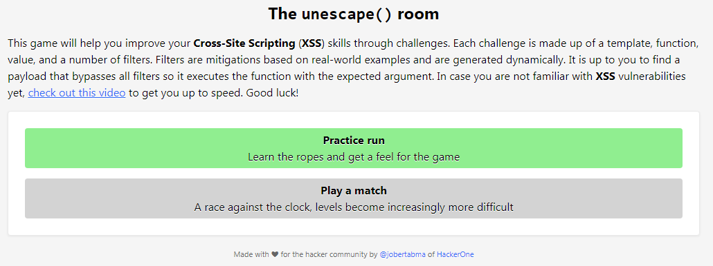

# Unescape() room

[Unescape() room](https://unescape-room.jobertabma.nl/) est une série de challenges créés par [Jober Abma](https://twitter.com/jobertabma) permettant de s’entraîner à forger des payloads XSS. Ces challenges sont répartis sur 10 niveaux de difficultés et utilisent un système de filtrage/protection dynamique.

La plateforme propose deux modes distincts :&#x20;

* **Practice run** : afin de s’entraîner
* **Play a match** : parcours contre la montre

Je propose ici quelques une de mes résolutions effectuées en mode **Practice run**.
