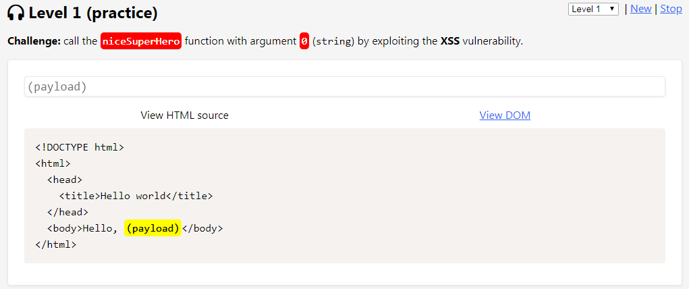

# Level 1 (practice)

## Challenge

### Description

Appeler la fonction `niceSuperHero()` avec la chaîne de caractères `"0"` en argument :

### Résolution

La premier niveau n'offre aucune difficulté puisque aucun filtre n'est présent. Je tente ici la payload la plus classique qui fonctionne très bien :

.png>)
