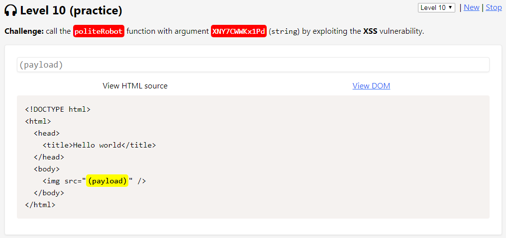
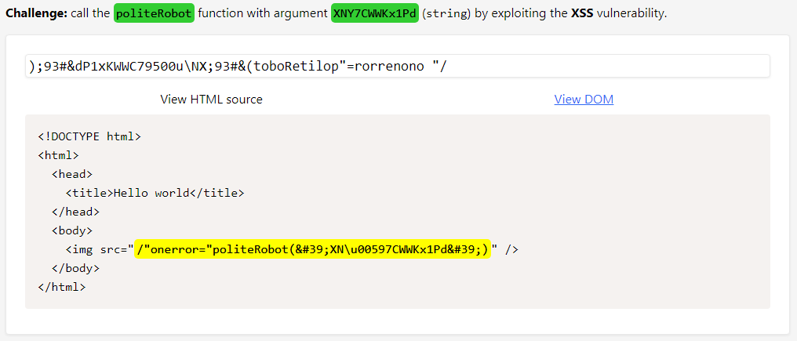
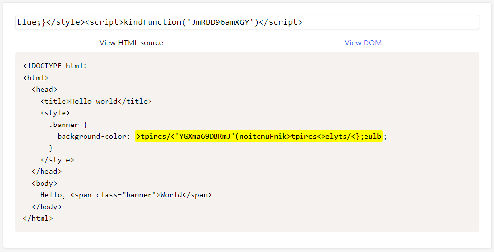
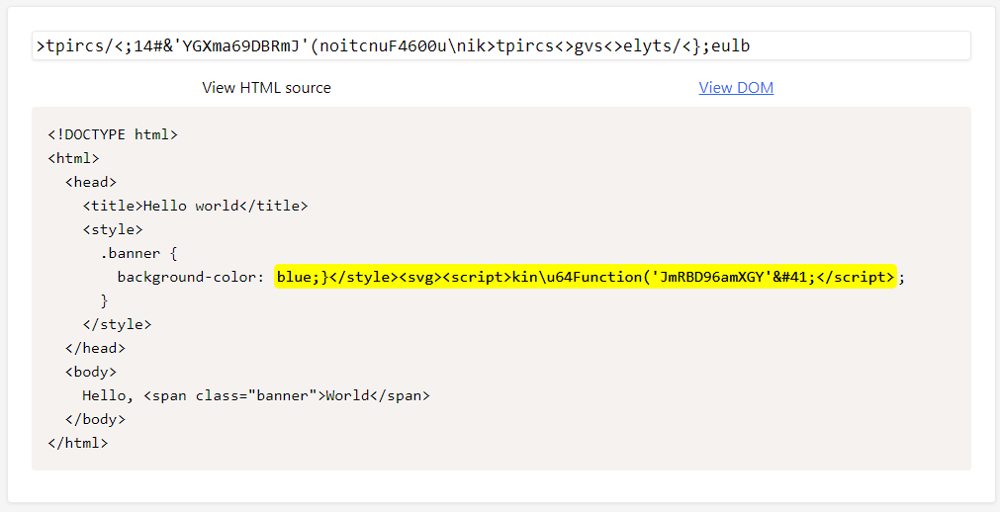
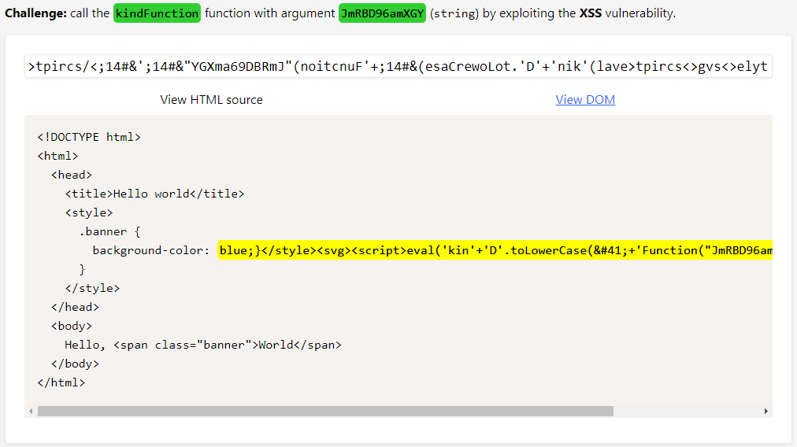

# Level 10 (practice)

## Challenge #1

### Description

Appeler la fonction `politeRobot()` avec la chaîne de caractères `"XNY7CWWKx1Pd"` en argument mais cette fois sur l'attribut `src` dans une balise `` :



### Résolution

Dans ce challenge, en plus de l'inversion de la chaîne, un filtrage est effectué sur le caractère `"'" (simple quote)` ainsi que sur le caractère `"Y"` :


Une fois la chaîne inversée, je m’aperçois qu'un filtrage est également réalisé sur l'occurrence `"on"`mais il suffit de répéter le motif pour contourner la mécanique. J'utilise les HTML entities afin de pouvoir entourer de guillemets simples la chaîne à passer en paramètre. Puis pour terminer, j'utilise l'encodage unicode afin de gérer le cas du `"Y"` :



## Challenge #2

### Description

Appeler la fonction `kindFunction()` avec la chaîne de caractères `"JmRBD96amXGY"` en argument mais cette fois sur la valeur de la propriété `background-color` du sélecteur `banner` :


### Résolution

Le but ici est de fermer la balise `<style>` puis d'injecter le script. Une des deux parenthèses est filtrée ici ainsi que le caractère `"d"`. Reste à voir si aucun autre filtre se déclenche lorsque je vais inverser la payload :



Aucun autre filtre ne s'active une fois la chaîne inversée. Par contre je dois insérer une balise `<svg>` afin de pouvoir remplacer la parenthèse par son équivalent HTML entities :

.png>)

Le caractère `"d"` est filtré mais également le caractère `"0"`. Manque de chance, son équivalent unicode est `\u0046` et son équivelent HTML entities est `&#100;` ...



Pour contourner cela, j'utilise en plus la fonction `eval()` ainsi qu'un `toLowerCase()` sur le `"D"` :



La payload dépassant du champ `<input>` voici sa version complète et non inversée :slight\_smile: :

```
blue;}</style><svg><script>eval('kin'+'D'.toLowerCase(&#41;+'Function("JmRBD96amXGY"&#41;'&#41;</script>
```

## Challenge #3

### Description

Appeler la fonction `kindHuman()` avec la chaîne de caractères `"Eph040Cwo0gt"` en argument au sein de la valeur d'une variable Javascript :

.png>)

### Résolution

Avec un peu de chance je ne vais rencontrer aucune difficulté sur ce challenge là car seul le caractère `"E"` semble être filtré :


En effet, je remplace le caractère par son équivalent unicode et je valide cet autre challenge :


## Challenge #4

### Description

Appeler la fonction `prettyFunction()` avec la chaîne de caractères `"MRRjzgB2zCHk"` en argument mais cette fois en valeur d'une donnée JSON stockée dans la variable `window.appData` :

.png>)

### Résolution

Pas mal de filtres pour ce dernier challenge et j'avoue l'avoir passé avec de la chance et surtout, avec beaucoup de tentatives. Le mot clé `"script"` est filtré mais contournable en utilisant un contournement bien connu comme `"scrscriptipt"` auquel j'ajoute des majuscules pour passer quelques autres filtres.&#x20;

L'occurrence `"on"` , présent dans le nom de la fonction, est filtré, mais il est possible de contourner cette limitation en utilisant l'occurrence `"oonn"` . De plus, dans un premier temps j'ai du ajouter des caractères aléatoires au niveau du paramètre de la fonction pour récupérer une sortie lisible :


A noter ici que dans la chaîne passée en argument, les caractères `"a"`, `"b"` et `"\"` sont filtrés. Cela m'a permis de modifier la longueur de la chaîne sans en modifier son contenu et ainsi, de récupérer une sortie lisible afin de valider ce dernier challenge :


