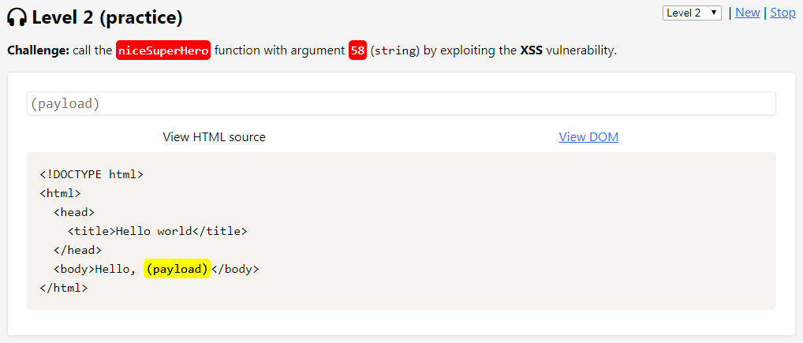
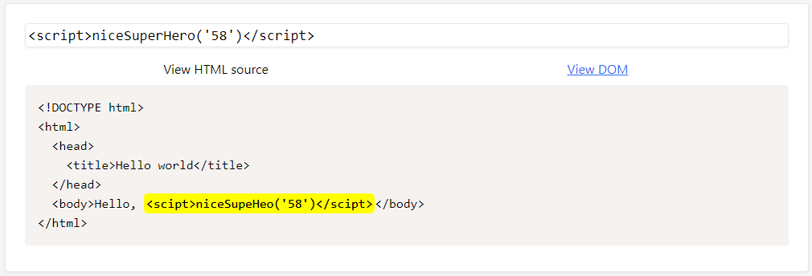
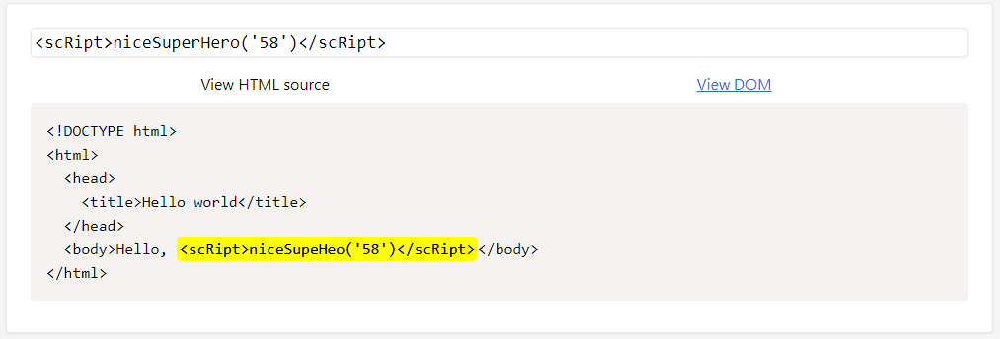
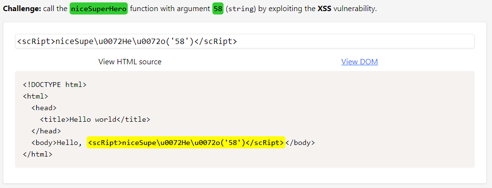

# Level 2 (practice)

## Challenge

### Description

Appeler la fonction `niceSuperHero()` avec la chaîne de caractères `"58"` en argument :

### Résolution

Un filtre supprime les occurrences du caractères `"r"`. Ce caractère est présent dans le nom de la fonction mais également dans la balise `` :

La balise `` peut être écrite indépendamment de la casse utilisée, il est donc également possible d'utiliser le caractère `"R"` mais cette technique ne peut pas fonctionner pour le nom de la fonction car case sensitive :

Afin de contourner le filtre, j'utilise le format de caractère unicode, soit ici `\u0072` :

