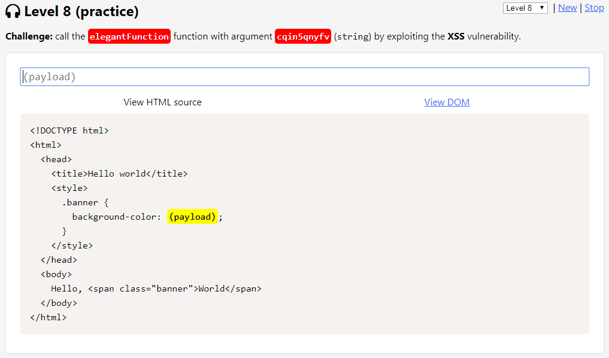
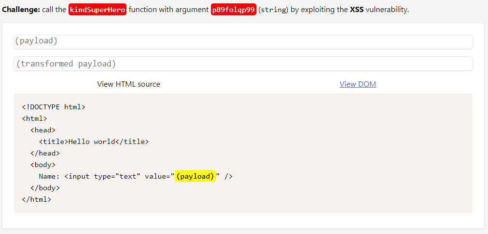

# Level 8 (practice)

## Challenge #1

### Description

Appeler la fonction `tallSuperHero()` avec la chaîne de caractères `"1mzslvt3gc"` en argument :

### Résolution

En plus de la chaîne renversée, les caractères `"'" (simple quote)`, `"S"` ainsi que `"e"` sont filtrés :

En essayant plusieurs payloads je me rends compte que le caractère `"5"` est également filtré. C'est assez gênant car le caractère `"S"` est représente par `"\u0053"` en unicode et le caractère `"e"` par `"\u0065"`empêchant cette technique de contournement.&#x20;

La technique est ici alors d'utiliser la balise `<svg>`. Cette balise va permettre d'utiliser les HTML entities au sein de la balise `` car la balise `<svg>` fait travailler dans un contexte XML :

## Challenge #2

### Description

Appeler la fonction `tallRobot()` avec la chaîne de caractères `"ocxzd5fkum"` en argument mais cette fois sur l'attribut `src` dans une balise `` :

### Résolution

Une inversion de la chaîne (pour changer :stuck\_out\_tongue: ) , un filtrage sur le caractère `"5"` ainsi que sur le caractère `"m"` :

Une concaténation avec une opération mathématique ainsi qu'un `toLowerCase()` suffit à valider ce challenge :

## Challenge #3

### Description

Appeler la fonction `braveHuman()` avec la chaîne de caractères `"jbtczli6o0"` en argument mais cette fois sur l'attribut `href` dans une balise `<a>` :

### Résolution

Challenge très facile puisque le seul caractère filtré est le `"0"` qui est présent dans la chaîne de caractères passée en paramètre :

Une opération mathématique suffit à contourner ce filtre (ne pas oublier de cliquer sur le lien dans la vue DOM pour activer la payload) :

## Challenge #4

### Description

Appeler la fonction `elegantFunction()` avec la chaîne de caractères `"cqin5qnyfv"` en argument mais cette fois sur la valeur de la propriété `background-color` du sélecteur `banner` :

### Résolution

Ce challenge semble proposer une inversion de la chaîne de caractères et un filtre sur les caractères `"y"` et `"F"` :

Concernant le caractère `"y"` il suffit de le répéter dans la balise `<style>` car seule la première occurrence semble être supprimée. L'encodage unicode va me permettre d'appeler correctement la fonction malgré le filtrage du caractère `"F"`, puis, j'inverse le tout :

## Challenge #5

### Description

Appeler la fonction `kindSuperHero()` avec la chaîne de caractères `"p89folqp99"` en argument mais cette fois sur l'attribut `value` du tag `<input/>` :

### Résolution

On s’aperçoit que le caractère `" " (espace)` est filtré et que la chaîne est inversée :

Le filtrage sur le caractère `" " (espace)` n'est pas gênant car il n'est pas nécessaire dans la balise. Par contre, si j'inverse ma payload, un second filtrage (voir même un brouillage :laughing: ) s'active :

Après quelques recherches, le fautif semble être trouvé. Il s'agit non pas d'un caractère spécifique mais sans doute de l'emplacement de ce caractère voir peut être de la longueur de la chaîne. En effet, il semblerait que la chaîne s'affiche correctement seulement lorsque la transformation base64 se termine par un signe `"="`. Un encodage unicode du `"S"` va permettre de faire passer ma payload et de valider ce challenge :

## Challenge #6

### Description

Appeler la fonction `kindSuperHero()` avec la chaîne de caractères `"z569avwq74"` en argument au sein de la valeur d'une variable Javascript :

### Résolution

Le filtrage s'effectue seulement sur les caractères `"4"` et `"5"` présent dans la chaîne passée en argument :

Le contournement est assez facile ici puisqu'une concaténation avec des opérations mathématiques suffit :

## Challenge #7

### Description

Appeler la fonction `fancyFunction()` avec la chaîne de caractères `"fdk8qhry90"` en argument mais cette fois en valeur d'une donnée JSON stockée dans la variable `window.appData` :

### Résolution

Premièrement la chaîne est inversée, et, plus embêtant, le caractère `"<"` est filtré ainsi que le caractère `"d"` :

Il me faut donc trouver une payload qui n'a pas besoin de fermer la balise `<script>` ouverte et également gérer la fin de la variable JSON, à savoir `"};"` , afin de ne pas avoir d'erreur de syntaxe.&#x20;

En essayant plusieurs payload, je me rends compte du filtrage de l'occurrence `"on"` ainsi que celui du  caractère `"4"`. Pour contourner cela, il suffira de doubler le `"on"` et d'utiliser la méthode `toLowerCase()`pour le caractère `"d"` (son encodage unicode n'était pas possible car il contient le caractère `"4"` ) :

