# Level 9 (practice)

## Challenge #1

### Description

Appeler la fonction `braveSuperHero()` avec la chaîne de caractères `"viaq7ed38yz"` en argument mais cette fois sur l'attribut `src` dans une balise `` :

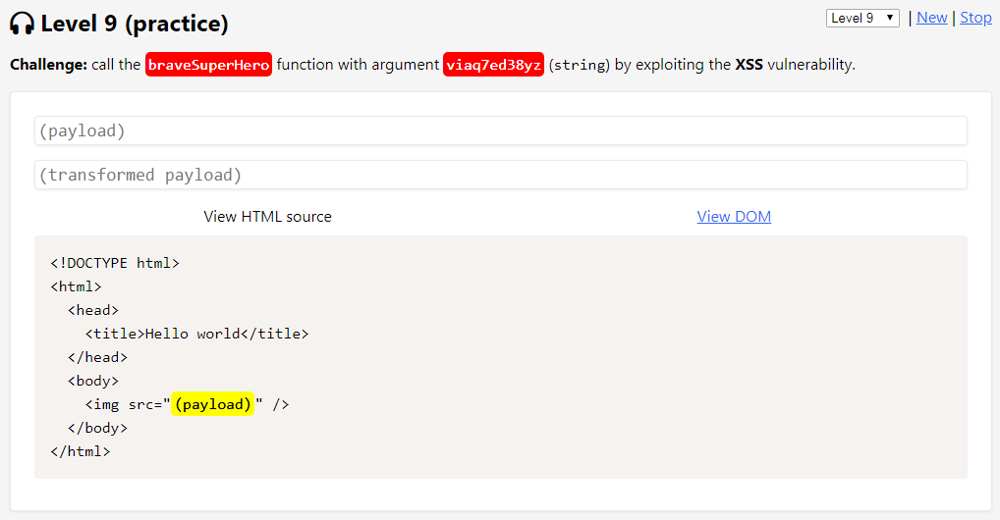

### Résolution

Le caractère `"8"` est ici filtré et la chaîne est inversée :

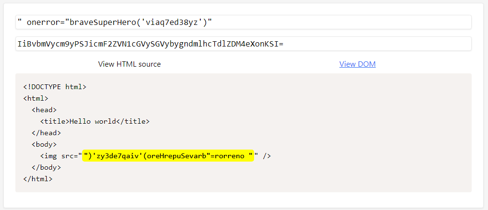

Lorsque je tente seulement d'inverser la chaîne et de gérer le caractère filtré avec une opération mathématique, plus rien ne s'affiche :

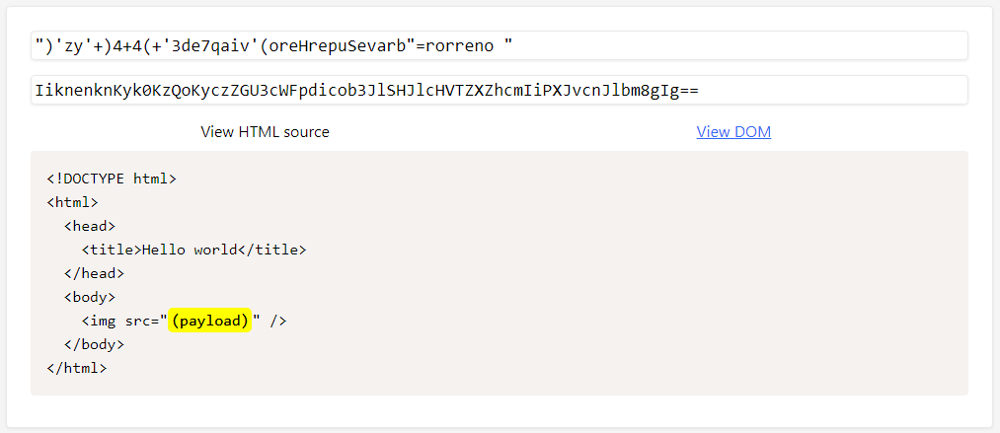

C'est plutôt difficile de trouver exactement les filtres en place ici, mais la longueur de la payload semble jouer un rôle. De plus, en allant pas à pas j'ai du utiliser la méthode `toLowerCase()` pour les caractères `"z"` et `"a"` ce qui m'a permis de valider ce challenge :

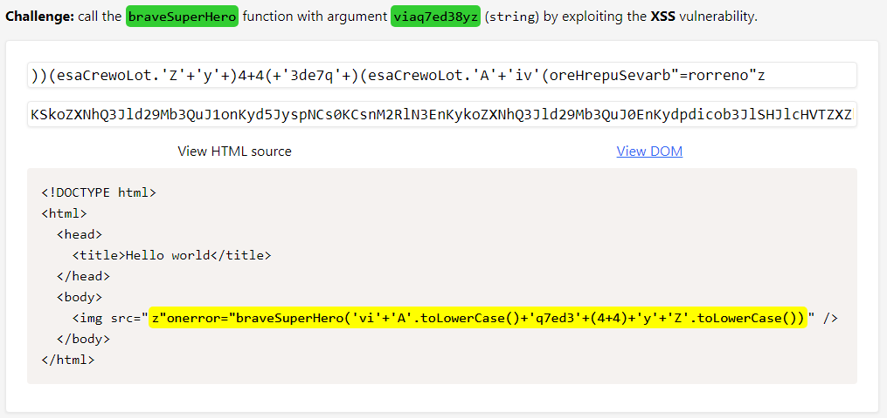

## Challenge #2

### Description

Appeler la fonction `fancyHuman()` avec la chaîne de caractères `"rm2zma4i1v6"` en argument mais cette fois sur la valeur de la propriété `background-color` du sélecteur `banner` :

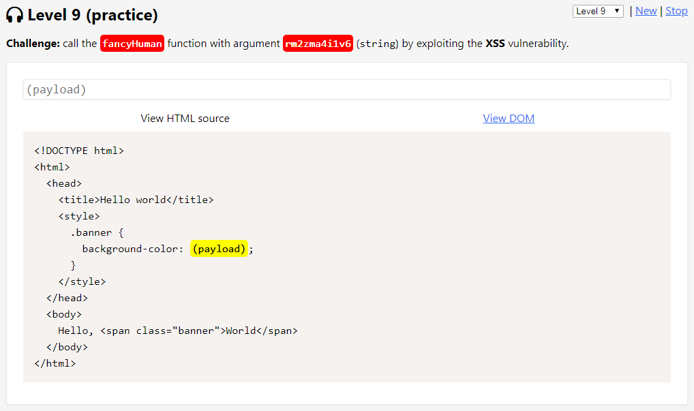

### Résolution

J'ai à priori de la chance car seul le caractère `"4"` semble être filtré. La chaîne est inversée, mais je commence à avoir l'habitude de cela :stuck\_out\_tongue: :

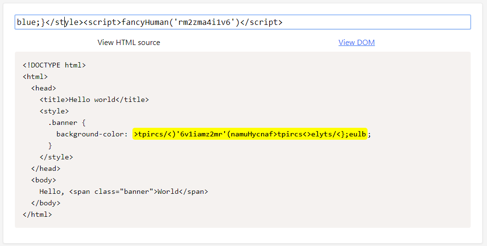

Une opération mathématique et un reverse après (hmm plutôt light pour un level 9 non ? :grin: ) :

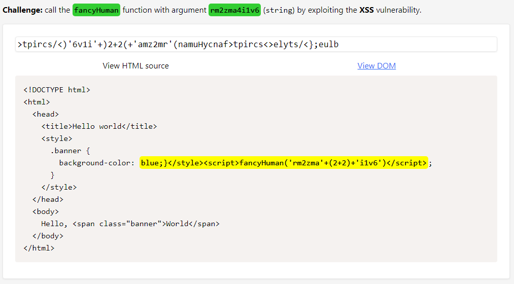

## Challenge #3

### Description

Appeler la fonction `fancyHuman()` avec la chaîne de caractères `"hhjot6krndy"` en argument au sein de la valeur d'une variable Javascript :

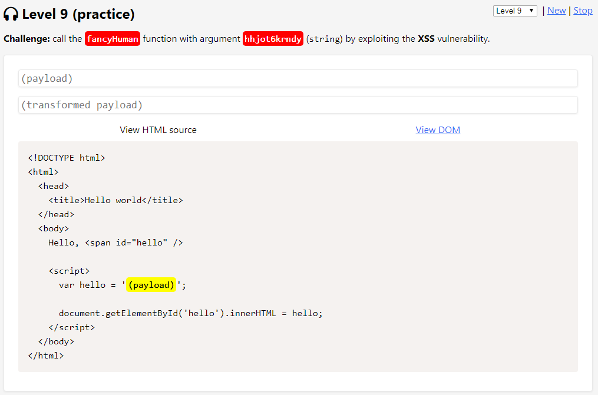

### Résolution

J'ai bien tenté ma chance en renseignant ma payload sans tenir compte des filtres et de faire un état des lieux après mais c'est difficile quand rien ne s'affiche en retour :

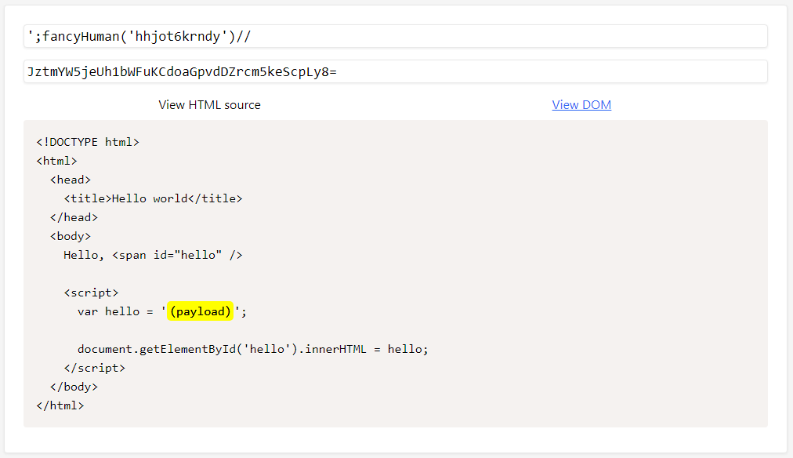

Alors ici j'ai expérimenté pas mal de choses ici. Dans un premier temps, le `"H"` ou `"h"` semblent être filtrés mais pas forcément au même endroit. Puis vient le tour de s'apercevoir du filtre sur l'occurrence `"//"` (je m'en servais pour commenter la fin de ligne). Il y a sans doute plus simple et je suis loin d'être sûr de moi quant aux filtres réellement en place, mais le challenge est tout de même validé :grin: :

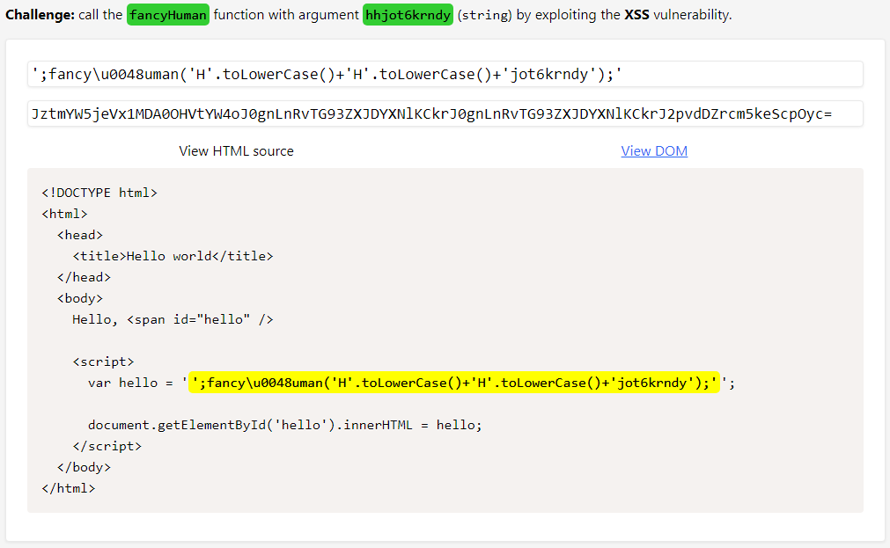

## Challenge #4

### Description

Appeler la fonction `tallFunction()` avec la chaîne de caractères `"e8ocf2bxv6h"` en argument mais cette fois en valeur d'une donnée JSON stockée dans la variable `window.appData` :

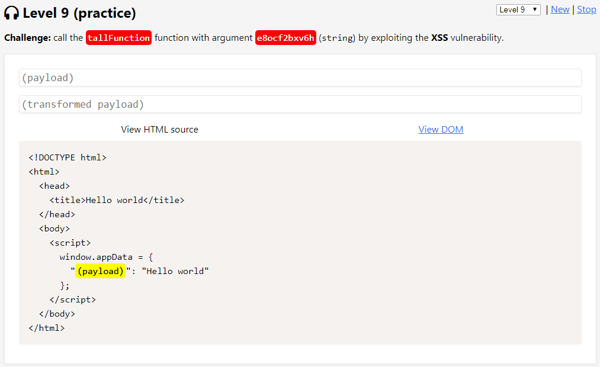

### Résolution

Je tente ici de fermer la première balise `` afin de ne pas avoir à m'occuper du dernier `"};"`. La parenthèse ouvrante `"("` est filtré ainsi que le caractère `"8"` et `"h"` de la chaîne en argument :

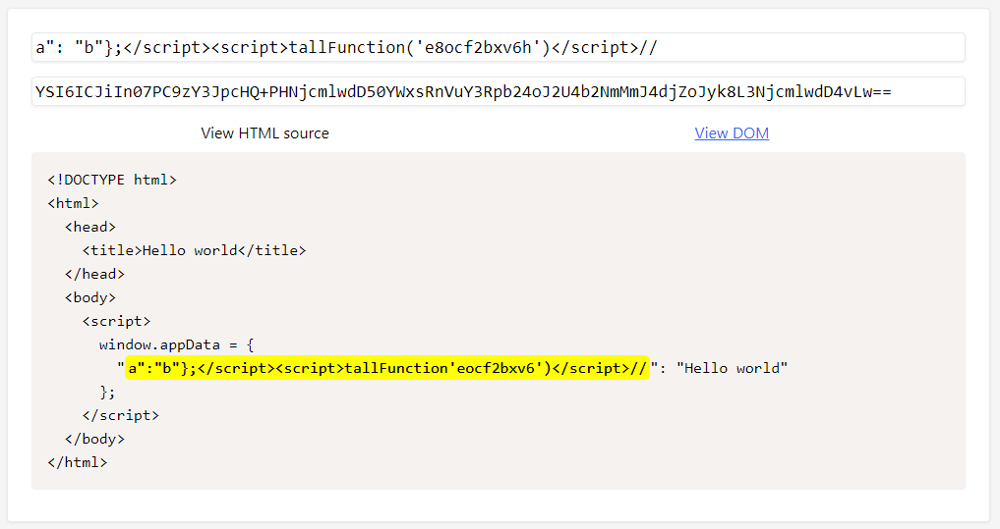

&#x20;Etant donné qu'il me faut contourner le filtre sur la parenthèse ouvrante j'utilise la balise `<svg>` afin de pouvoir utiliser son équivalent HTML entities. Le caractère `"h"`, qui est également filtré, possède un `"8"` dans son unicode, je passe alors également par son équivalent HTML entities :

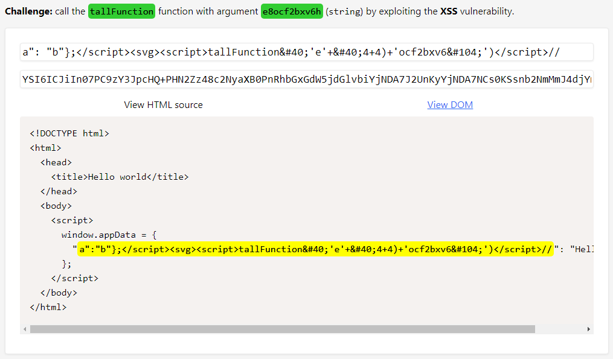
