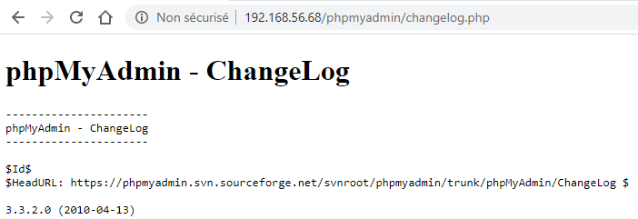
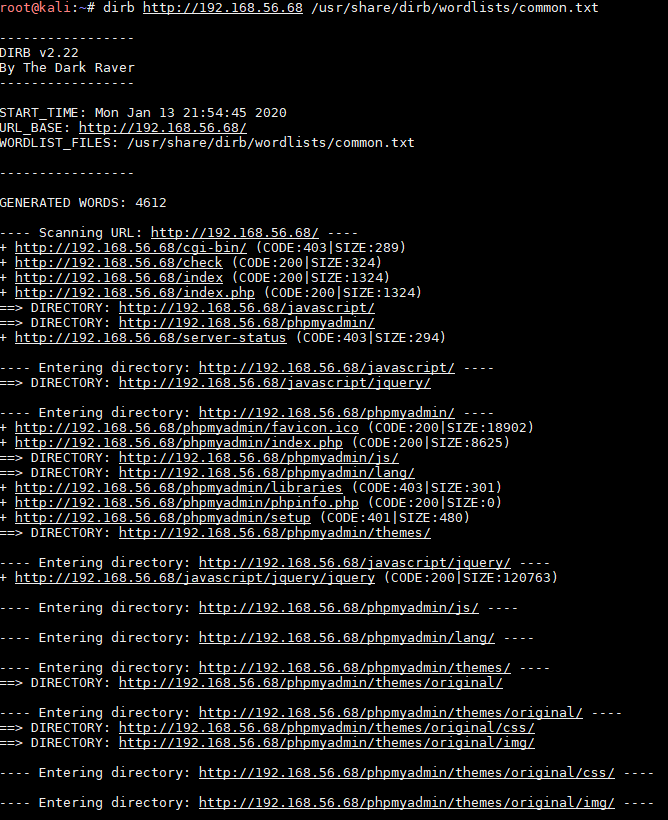
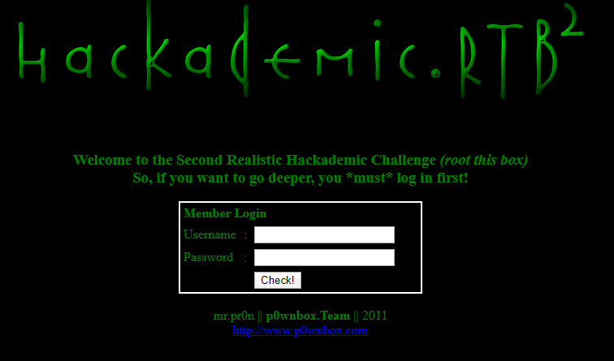
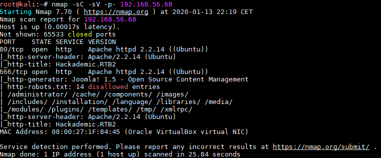
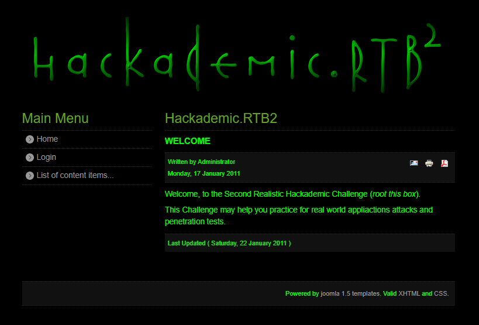
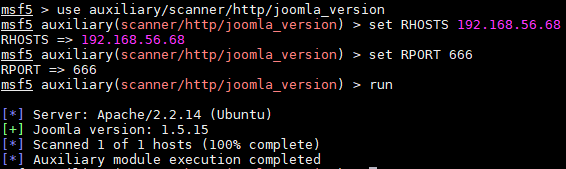
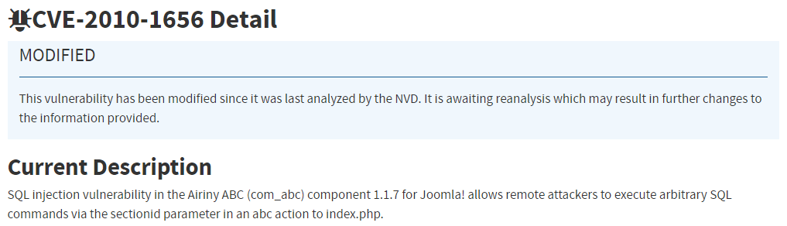
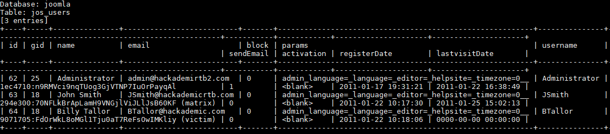
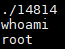

# Hackademic: RTB2

## Détails de la machine

**Nom :** Hackademic: RTB2\
**Date de sortie :** 6 Septembre 2011\
**Lien de téléchargement :** [https://download.vulnhub.com/hackademic/Hackademic.RTB2.zip](https://download.vulnhub.com/hackademic/Hackademic.RTB2.zip)\
**Niveau :** Facile\
**Objectif(s) :** obtenir un accès "root" et lire le flag situé dans le fichier `/root/Key.txt`\
**Description :**\
`This is the second realistic hackademic challenge (root this box) by mr.pr0n`\
`Download the target and get root.`\
`After all, try to read the contents of the file 'key.txt' in the root directory.`\
`Enjoy!`

## Reconnaissance

Je récupère l'adresse IP de la cible grâce à `netdiscover` :

Je continue en scannant la cible à l'adresse 192.168.56.68 via `nmap` :

Il y a donc un service web de disponible ainsi qu'un service sur le port 666 mais filtré par le pare-feu.

### Serveur Web

Une analyse avec `nikto` va me permettre d'en savoir un peu plus :

Le serveur web propose un phpMyAdmin. Je tente de connaitre sa version :&#x20;

Tout en lançons un `dirb` :

Rien de spécifique pour le `dirb`. Il est temps de naviguer sur le site proposé par la machine :

Malheureusement aucune des tentatives de weak credentials ne fonctionnent et pas grand chose d'autres d'intéressant à exploiter.

### Port knocking

Etant donné que le serveur web du port 80 ne semble pas très intéressant, je me concentre sur le port 666 qui semble être filtré. Ici un peu par chance (beaucoup de chance en fait), le port 666 est devenu ouvert :

Mais qu'elle est cette sorcellerie ? En effet, j'ai dit par chance car j'avais nettoyé mon terminal et donc dû relancer un nmap (ce qui a ouvert le port protégé par du port knocking). Le second scan n'indique pas que le port est ouvert (l'impression écran est le troisième scan), mais en essayant via le navigateur d'accéder à ce port filtré la page suivante s'est affichée :

Ce second site utilise le CMS Joomla en 1.5, il faudra sans doute creuser par là. Je commence tout d'abord par une petite reconnaissance avec `nikto` :&#x20;

Une page d'administration est disponible mais il semble que ce n'est pas la bonne direction :

Et le phpMyAdmin présent sur ce port est également en version 3.3.2.

### Joomla

J'attaque la reconnaissance du CMS Joomla qui semble être en version 1.5. `metsaploit` me donne quelques détails supplémentaires :

Il s'agit donc plus précisément de la version 1.5.15. Qu'en est t'il des plugins utilisés :

Le plugin com\_abc (ABC Joomla Extension) semble être vulnérable aux injections SQL, sans doute notre porte d'entrée.

## Exploitation

### Injection SQL

`metasploit` indique que le paramètre vulnérable est le paramètre "sectionid" (`http://192.168.56.68:666/index.php?option=com_abc&view=abc&letter=AS&sectionid='`).

En cherchant un peu j'identifie cette vulnérabilité comme étant la CVE-2010-1656 :

Ici je ne m'embête pas et je sors l'artillerie `sqlmap` pour l'exploitation. Je récupère deux mots de passe d'utilisateurs lambda mais pas celui de l'administrateur :

Les comptes de JSmith et BTallor ne donnent rien et ne permettent pas d'aller plus loin. Selon les droits que possède le compte se connectant à la base il est peut être possible d'écrire des fichiers et ainsi de récupérer un shell. &#x20;

Pour cela, il faut utiliser l'option `--os-shell` :

Je possède donc maintenant un shell sur la machine mais limité en droits puisque il s'agit du compte www-data.

## Élévation de privilèges

J'identifie la version du système d'exploitation :

Pour cette version, [Linux-suggester](https://github.com/mzet-/linux-exploit-suggester) propose l'exploit suivant :

Il s'agit d'un exploit en C à compiler :

Pour son exécution, il faut retrouver un shell un peu plus classique, je suis donc passé par l'option `--os-pwn` de `sqlmap` (le chemin du serveur web fait partie des "common location(s)") :

L'exécution de l'exploit me donne un accès root :

Je récupère le flag présent dans le fichier à l'emplacement /root/Key.txt (le fichier étant très long, la sortie est tronquée) :

Le texte est encodé en base64, son décodage nous donne une image :

## Conclusion

Machine sympathique que j'ai mis un certain temps à finir. La raison était que le shell récupéré était très instable et la connexion se fermait au bout de quelques secondes. Un peu de persévérance a finit par payer :wink: .

J'ai eu beaucoup de chance concernant le port knocking puisque un double `nmap` suffit à déclencher l'ouverture du port. Par curiosité, je suis allé voir la configuration de `knockd` que voici :

Il s'agit donc de la séquence par défaut, à savoir 7000, 8000 puis 9000 pour provoquer l'ouverture.
