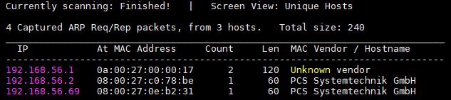
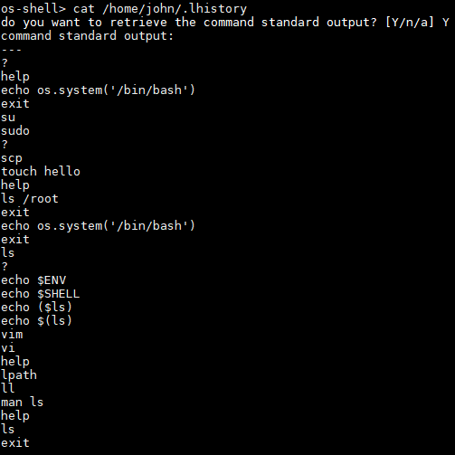

# Kioptrix: Level 1.3 (#4)

## Détails de la machine

**Nom :** Kioptrix: Level 1.3 (#4)\
**Date de sortie :** 8 Février 2012\
**Lien de téléchargement :** [http://www.kioptrix.com/dlvm/Kioptrix4\_vmware.rar](http://www.kioptrix.com/dlvm/Kioptrix4\_vmware.rar)\
**Niveau :** Facile\
**Objectif(s) :** obtenir un accès "root"\
**Description :**

`Again a long delay between VMs, but that cannot be helped. Work, family must come first. Blogs and hobbies are pushed down the list. These things aren’t as easy to make as one may think. Time and some planning must be put into these challenges, to make sure that:`\
`1. It’s possible to get root remotely [ Edit: sorry not what I meant ]`\
`1a. It’s possible to remotely compromise the machine`\
&#x20; `2. Stays within the target audience of this site`\
&#x20; `3. Must be “realistic” (well kinda…)`\
&#x20; `4. Should serve as a refresher for me. Be it PHP or MySQL usage etc. Stuff I haven’t done in a while.`

## Reconnaissance

La machine cible possède l'adresse IP 192.168.56.69 :

Plusieurs services sont disponibles sur la machine : un serveur SSH, un serveur Web ou encore un partage de fichiers Samba :

### Service SSH

Pas de CVE intéressante du côté du service SSH.

### Serveur HTTP

Je démarre par un scan `nikto` :

Suivi de l'habituel `dirb` :

Cela donne un serveur Apache en 2.2.8 et PHP 5.2.4. Le `dirb` remonte un dossier qu'il faudra analyser à l'adresse `http://192.168.56.69/john/`.

Lors de la navigation sur le site, la page d'accueil présente une mire d'authentification :

Aucune tentative de compte par défaut ne fonctionnent :

Par contre l'injection d'un simple guillemet dans le champ mot de passe me permet d'identifier une potentielle injection SQL :

### Samba

Je commence par récupérer la version de Samba grâce au script `Metasploit` :

La version 3.0.28a de Samba semble posséder plusieurs vulnérabilités permettant un contrôle à distance (mais après quelques tests je n'ai pas réussi à faire fonctionner l'exploit) :

`Metasploit` va me permettre également d'énumérer les utilisateurs de la machine :

## Exploitation

### Injection SQL

Grâce à l'énumération smb il est possible d'utiliser l'injection SQL afin de se connecter avec un utilisateur donné et de récupérer son mot de passe. Pour cela, l'injection dans le champ mot de passe peut être `' OR 1=1 --`&#x20;

Par facilité, j'utilise `sqlmap` afin de dump la totalité de la base :

Rien de très intéressant, je ne récupère seulement que les mots de passe des utilisateurs john et robert. Il est possible de tenter de récupérer un shell via une injection SQL (suivant les droits de l'utilisateur). Tout d'abord il est possible de savoir quel compte s'y connecte :

Le shell a de fortes chances de fonctionner car l'utilisateur s'y connectant est l'utilisateur root. La seconde information nécessaire est le chemin de l'arborescence des pages web ; L'erreur SQL me donne cette information :

Quelques secondes plus tard, `sqlmap` me ramène un shell :

## Élévation de privilèges

Ici après pas mal de recherches. Il s'avère qu'il est possible de se connecter en SSH avec le compte de john ou robert mais le shell ainsi obtenu est un shell limité :

Dans le répertoire home de john, visité grâce au shell `sqlmap`, le fichier .lhistory indique une commande intéressante avec `echo` invoquant un bash car la commande `echo` est une commande autorisée :

Il est sans doute possible de s'en servir pour sortir du shell limité :

Cela fonctionne, le shell n'est plus limité, l'élévation de privilèges peut réellement commencer.

Tout d'abord il est possible de récupérer les identifiants du compte root se connectant à la base de données. Ces informations se situent dans le fichier checklogin.php :

`sys_exec` est une UDF qui n'est pas installée par défaut sur MySQL mais dans le cas où elle est présente, elle va me permettre d'exécuter des commandes en root. Je vérifie d'abord sa présence :

Cela semble le cas. Il me suffit alors d'ajouter l'utilisateur john dans le groupe admin :

Il est dont maintenant possible d'effectuer des commandes grâce à `sudo` :

## Conclusion

Début de VM sympathique mais l'élévation de privilèges était assez difficile (je ne connaissais pas les UDF) j'ai donc dû me rabattre à lire quelques autres writeups pour la terminer.

Sans en être sûr, il est peut être possible de continuer avec le webshell de `sqlmap` et de trouver un exploit existant sur cette version de Linux permettant une lpe.
