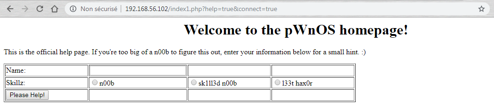
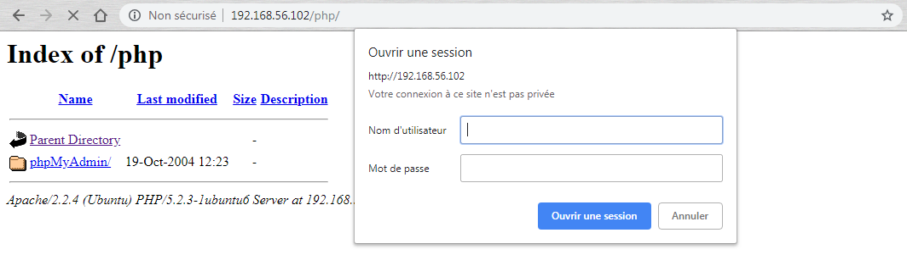
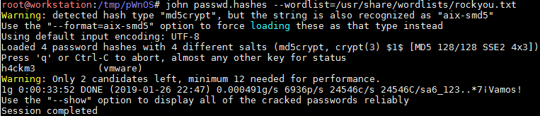

# pWnOS 1.0

## Détails de la machine

**Nom :** pWnOS 1.0\
**Date de sortie :** 27 Juin 2008\
**Lien de téléchargement :** [http://pwnos.com/files/pWnOS\_v1.0.zip](http://pwnos.com/files/pWnOS\_v1.0.zip)\
**Niveau :** Facile\
**Objectif(s) :** obtenir un accès "root"\
**Description :** \
`Some of you may have noticed this new pWnOS forum section. I created pWnOS as a virtual machine and Grendel was nice enough to let me post about it here. Here's a bit of information on pWnOS.`\
`It's a linux virtual machine intentionally configured with exploitable services to provide you with a path to r00t. :) Currently, the virtual machine NIC is configured in bridged networking, so it will obtain a normal IP address on the network you are connected to. You can easily change this to NAT or Host Only if you desire. A quick ping sweep will show the IP address of the virtual machine.`\
`Sorry...no scenario/storyline with this one. I wasn't really planning to release it like this, so maybe for version 2.0 I'll be more creative. :) I'm anxious to get feedback so let me know how it goes or if you have questions. Thanks and good luck!`

## Reconnaissance

Je commence par identifier la cible grâce à l'outil `netdiscover` :&#x20;

L'outil `nmap` va permettre de connaitre les services disponibles s'exécutant sur la machine :

Il y a donc un service SSH (port 22), un serveur HTTP (port 80), des services NetBIOS/SMB (port 139 et 445) ainsi qu'un Webmin (port 10000).

### Service SSH

Le service SSH est un OpenSSH en version 4.6p1, `searchsploit` donne un exploit compatible qui pourrait m'aider pour la suite :

En effet, il est possible d'effectuer une énumération de comptes grâce à la vulnérabilité CVE-2018-15473 et à l'exploit "OpenSSH < 7.7 - User Enumeration (2)".

### Serveur HTTP

Je m'intéresse ensuite au serveur HTTP disponible sur le port 80 dont voici la page d'accueil :

Rien d'intéressant sur la première page, je continue l'exploration par le bouton "Next" :

Deux paramètres sont ici présents, "help" et "connect" qui ont pour valeur "true"_._ Je commence par les modifier afin de voir le comportement du serveur. Ce qui me permet d'identifier une possible LFI/RFI :

Je prends note de cela dans un coin et continue l'exploration du site web :

Même si cela ne m'aide pas, je remarque ici que les deux paramètres de l'URL "name" et "level_"_ sont vulnérables à une faille XSS. Etant donné qu'il s'agit d'une XSS réfléchie, Chrome va bloquer son exploitation, il faudra donc utiliser Firefox à la place :

En parallèle de la navigation, j'ai également lancé un `nikto` ainsi qu'un `dirb` dont voici les résultats :

`nikto` indique des versions d'Apache et de PHP obsolètes, la présence d'un répertoire "/php" ainsi que l'éventuel présence d'une LFI/RFI.

Quand à `dirb` :

Il indique également la présence de répertoire "/php" et m'avertis que le listing directory y est possible :

Il s'agit d'un PhpMyAdmin protégé par une authentification HTTP Basic_._ Le test d'un premier couple de login/mot de passe me conduis à une erreur mais j'obtiens ainsi sa version :

C'en est fini de la reconnaissance du service web, je passe aux autres services disponibles.

### Samba

Je commence par un `nbtscan` afin de connaître un peu mieux ma cible :

La troisième colonne indique que la machine partage (ou est en mesure de le faire) certains dossiers. Je tente de me connecter grâce à `rpcclient` en tant qu'utilisateur anonyme :

Ce qui amène à l'énumération des utilisateurs Samba et des répertoires partagés :

Je tente ensuite d'accéder à ces répertoires partagés :

Aucun droit qui me permet d'aller plus loin, mais l'énumération m'a donné le nom d'un utilisateur de la machine : "vmware".

### Webmin

La navigation sur le port 10000 de la machine me conduis à une page web demandent un login / mot de passe pour pouvoir accéder au service Webmin :

Un `searchsploit` m'indique une vulnérabilité qui peut être intéressante (Arbitrary File Disclosure) :

La phase de reconnaissance est maintenant terminée, je passe à l'exploitation.

## Exploitation

### Webmin (CVE-2006-3392)

Je commence par exploiter la vulnérabilité la plus simple qui est celle de Webmin, en effet un module Metasploit existe pour me faciliter la vie :p, mais elle est tellement simple que je l'exploite manuellement. Afin d'accéder à un fichier présent sur le serveur il suffit d’accéder à cette URL (le pattern est une répétition de "..%01") :

`http://target:port/unauthenticated/pattern/filename`

Je récupère donc le fichier "/etc/passwd" afin de connaitre la liste complète des utilisateurs :

Il y a donc bien l'utilisateur "vmware" ainsi que "obama", "osama" et "yomama". Je tente avec un fichier un peu plus sensible, le fichier "/etc/shadow" :

Bingo ! Le service Webmin doit sans doute tourner avec les droits root pour pouvoir accéder en lecture à ce fichier. Je casse ces mots de passe avec `john` (ne pas oublier de faire un `unshadow` avant) :

Un seul mot de passe est cassé, celui de "vmware". Je peux donc maintenant me connecter en SSH en utilisant le nom d'utilisateur "vmware" et le mot de passe "h4ckm3" :

## Élévation de privilèges

Un `uname -a` donne rapidement le numéro de version du noyau du système :

Le script `Linux_Exploit_Suggester` permet de connaitre les potentiels exploits d'élévation de privilèges :

Un exploit qui a fonctionné est le "vmsplice1", soit la CVE-2008-0600. La machine n'ayant pas accès à internet dans mon cas, je copie l'exploit grâce à `scp` :

Sur la cible, je compile puis exécute l'exploit :

Congratz ! Je deviens "root" (qui n'a d'ailleurs en fait pas de nom ;) )!

## Conclusion

Machine plutôt facile grâce à l'accès à n'importe quel fichier via la vulnérabilité sur le Webmin qui tourne en "root" et qui permet de récupérer le fichier "/etc/shadow" :

L'élévation de privilèges à partir du compte "vmware" n'a pas posée de problème, l'exploit utilisé fonctionnant du premier coup.&#x20;

Je me demande si en passant un peu plus de temps sur le service smb il n'y a pas moyen d'obtenir plus d'information. De mémoire il n'y a pas de vulnérabilité intéressante concernant le phpmyadmin mais j'avoue ne pas avoir creuser beaucoup cette piste. A noter qu'il y a également une vulnérabilité d'OpenSSL (voir [https://en.wikipedia.org/wiki/OpenSSL#Predictable\_private\_keys\_(Debian-specific)](https://en.wikipedia.org/wiki/OpenSSL#Predictable\_private\_keys\_\(Debian-specific\))) qui permet de se connecter en SSH en retrouvant certaines clés privées, mais je suis passé à côté de celle-ci.
