# Level 3 (practice)

## Challenge #1

### Description

Appeler la fonction `prettyHuman()` avec la chaîne de caractères `"798"` en argument :

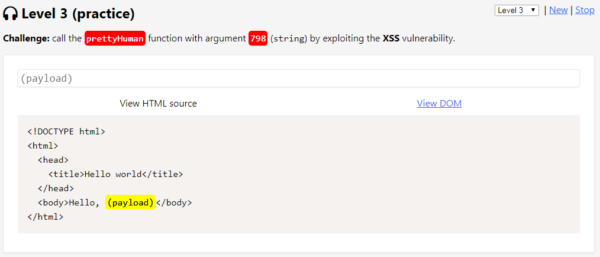

### Résolution

Il s'agit sensiblement du même filtrage que le challenge du niveau 2, à savoir un filtre sur la lettre `"t"` :

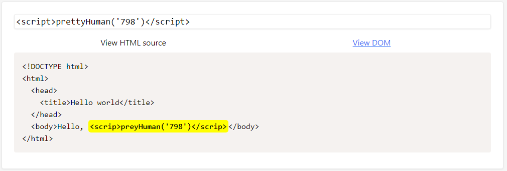

De la même manière, je contourne le filtrage en place en utilisant le caractère filtré en majuscule ou son code unicode suivant le contexte :

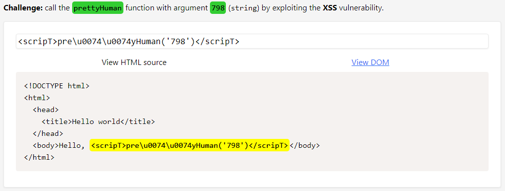

## Challenge #2

### Description

Appeler la fonction `kindHuman()` avec la chaîne de caractères `"079"` en argument mais cette fois sur l'attribut `src` dans une balise `` :

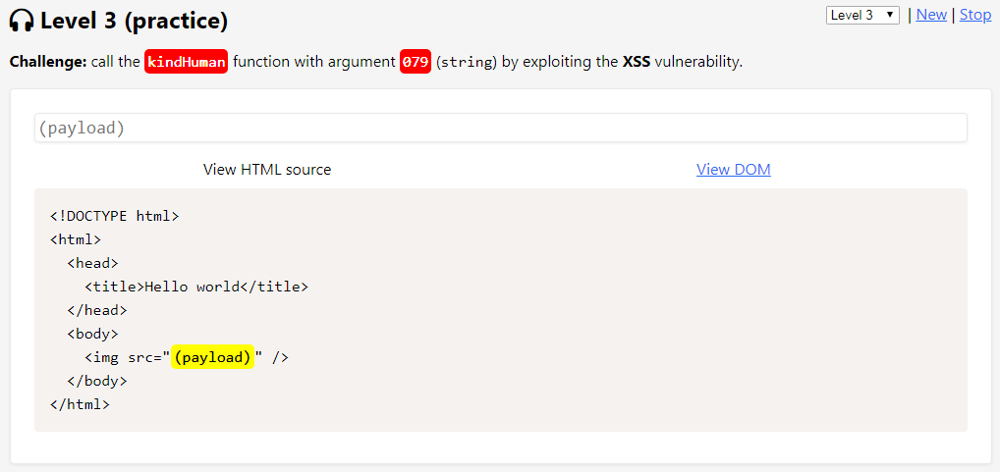

### Résolution

Le filtrage s'effectue ici sur le caractère `"  " (espace)` ainsi que sur le caractère `"u"` :

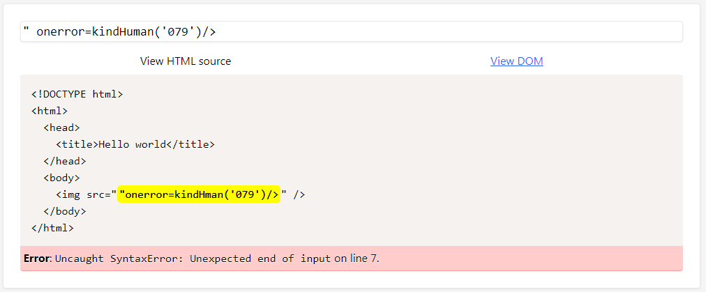

Le filtrage sur le caractère `"u"` est un peu embêtant car il m'empêche d'utiliser la notation unicode. Je change donc de technique et passe via un `String.fromCharCode()` conjointement avec la fonction `eval()` :

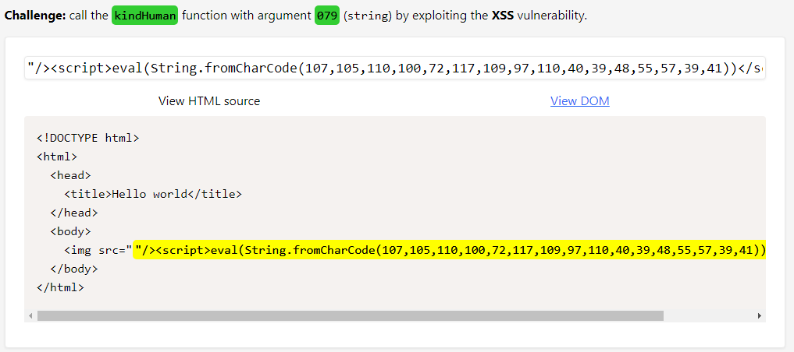

## Challenge #3

### Description

Appeler la fonction `kindSuperHero()` avec la chaîne de caractères `"929"` en argument mais cette fois sur l'attribut `href` dans une balise `<a>` :

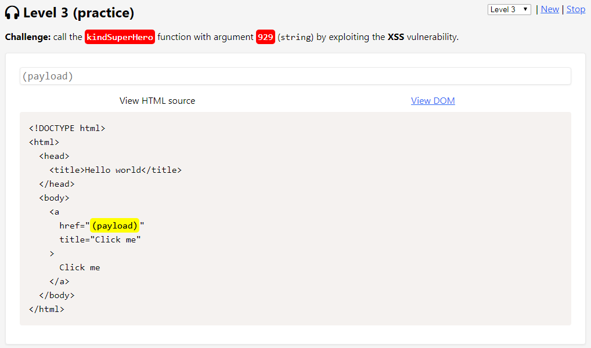

### Résolution

Au sein d'un attribut `href` il est possible d'utiliser la syntaxe `javascript:code` (par exemple `href="javascript:alert(1)"`) afin d'exploiter une XSS. Dans ce cas, seul le caractère `"9"`, présent dans le paramètre de la fonction, semble être filtré :

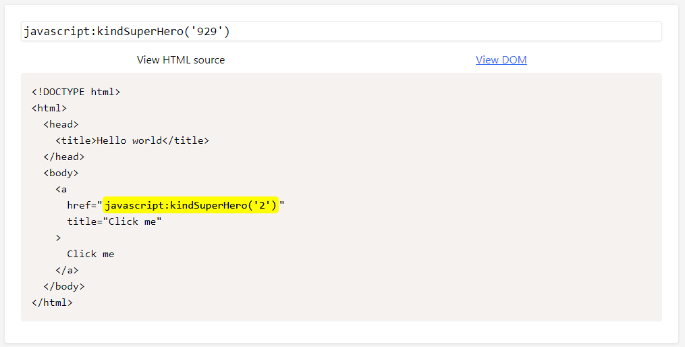

Grâce à la concaténation (et à la conversion implicite), il est possible de représenter `"9"` par une autre opération mathématique :

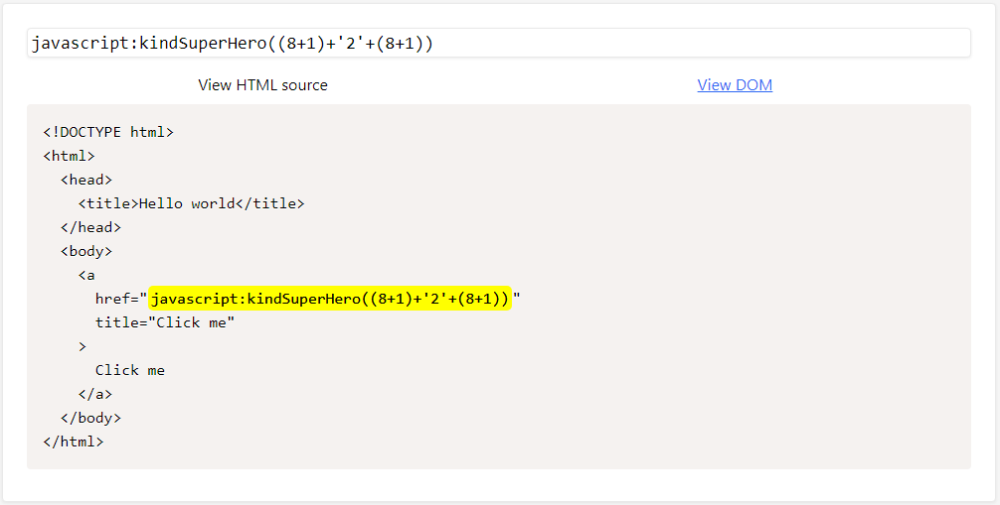

Ne pas oublier de passer par la vue DOM (View DOM) et de cliquer sur le lien afin d'exécuter la payload :

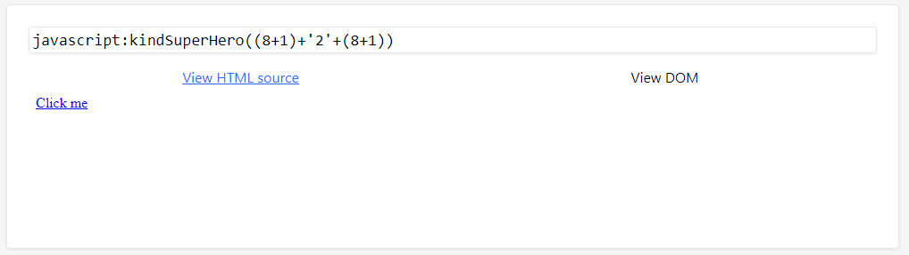

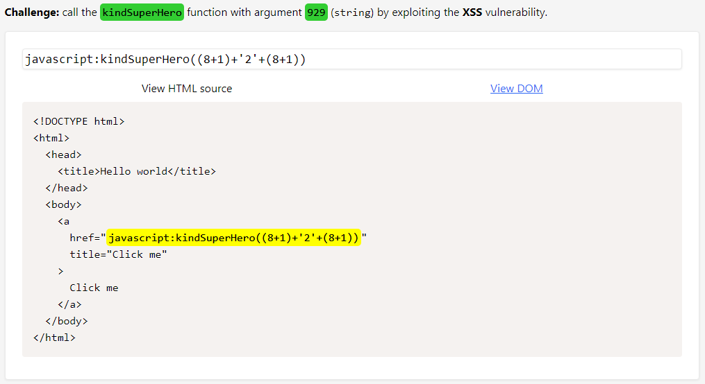
