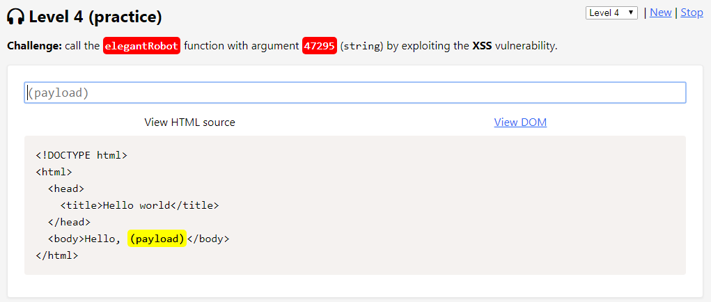
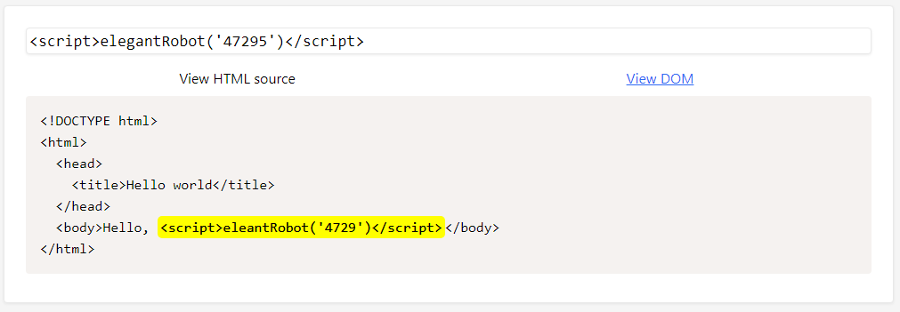
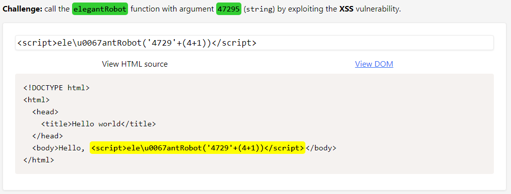
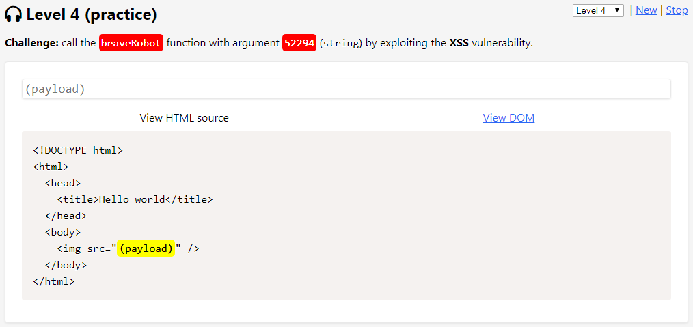
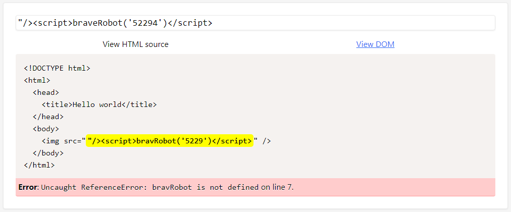
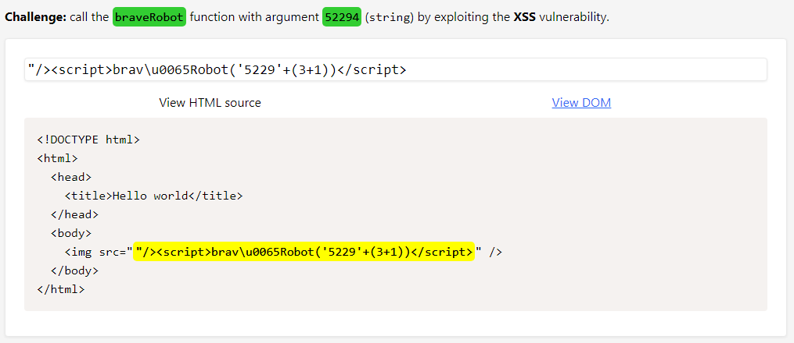
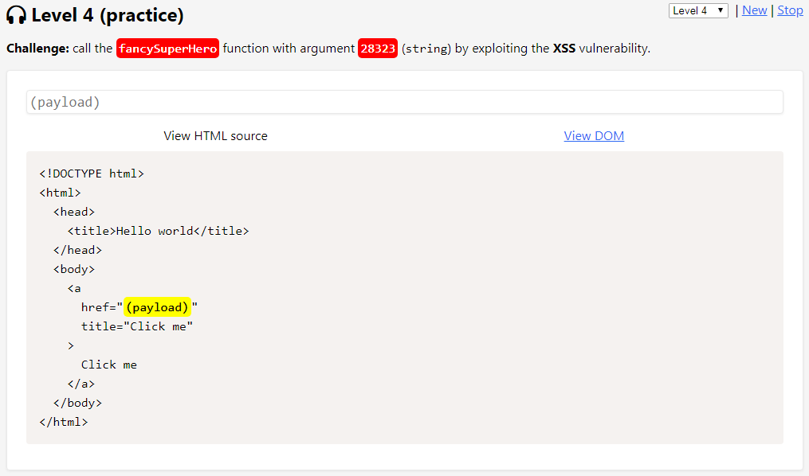
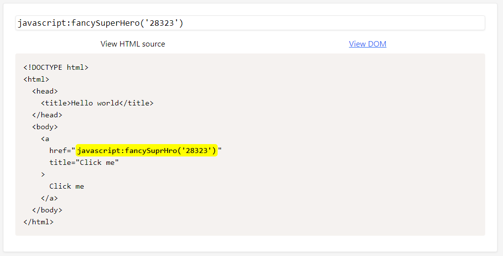
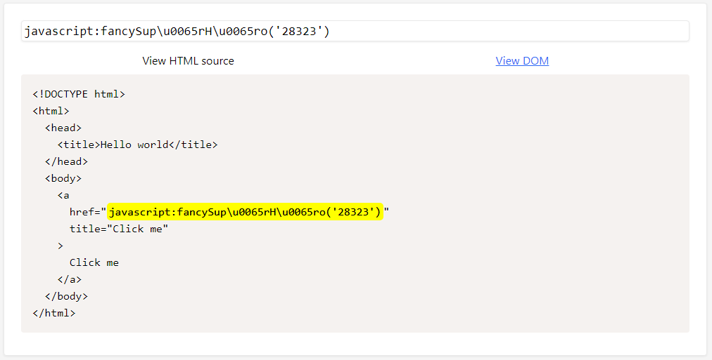

# Level 4 (practice)

## Challenge #1

### Description

Appeler la fonction `elegantRobot()` avec la chaîne de caractères `"47295"` en argument :

### Résolution

Un filtrage plutôt simple ici puisqu'il s'agit d'un filtre sur le caractère `"g"` ainsi que sur le caractère `"5"` :

La notation unicode ainsi que l'opération mathématique permet de s'en passer outre aisément :

## Challenge #2

### Description

Appeler la fonction `braveRobot()` avec la chaîne de caractères `"52294"` en argument mais cette fois sur l'attribut `src` dans une balise `` :

### Résolution

Un filtrage est effectué sur le caractère `"e"` ainsi que sur le caractère `"4"` :

Il est possible de le contourner en utilisant les mêmes techniques que précédemment à savoir l'encodage unicode ainsi que l'opération mathématique :

## Challenge #3

### Description

Appeler la fonction `fancySuperHero()` avec la chaîne de caractères `"28323"` en argument mais cette fois sur l'attribut `href` dans une balise `<a>` :

### Résolution

Un mécanisme de filtrage est présent mais exclusivement sur le caractère `"e"` :

Soit, en utilisant l'encodage unicode :

Etant donné que notre payload se situe dans un `href`, il ne faut pas oublier de cliquer sur le lien pour déclencher l'injection (View DOM) :

