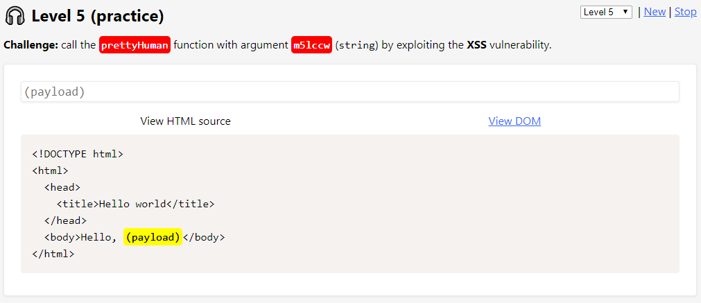
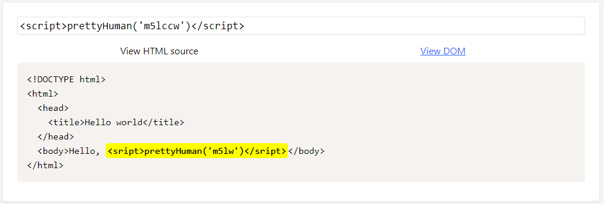
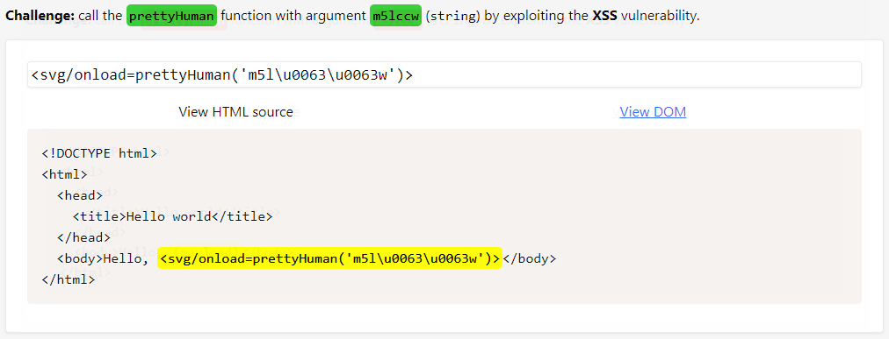
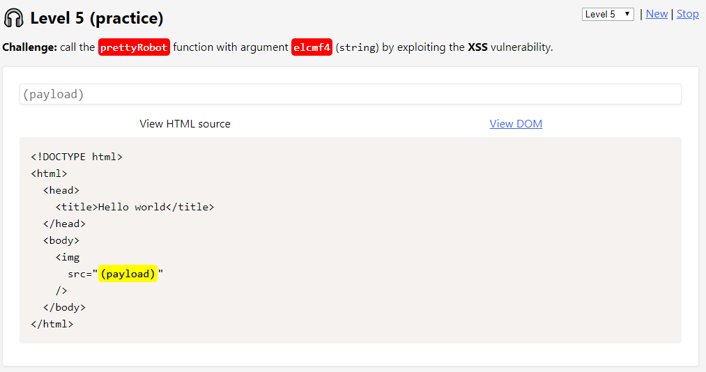
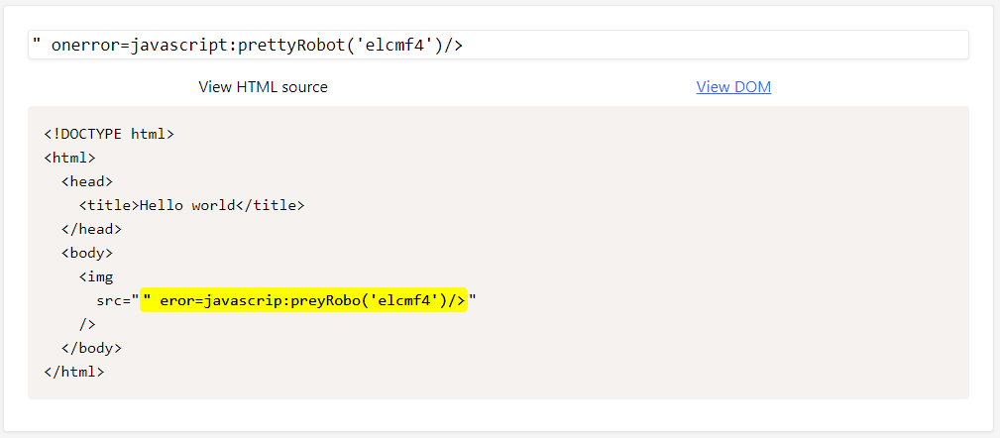
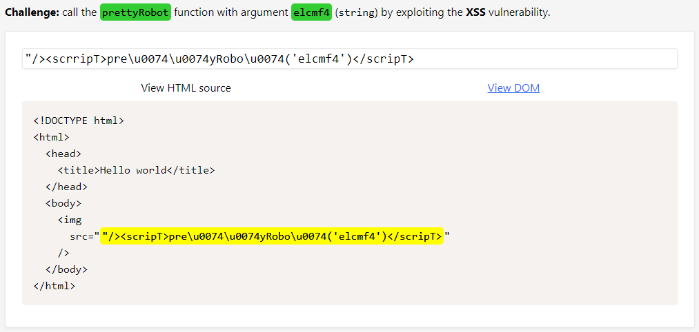
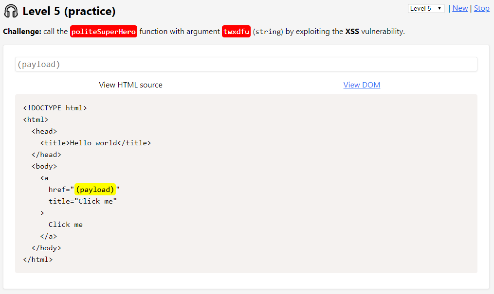
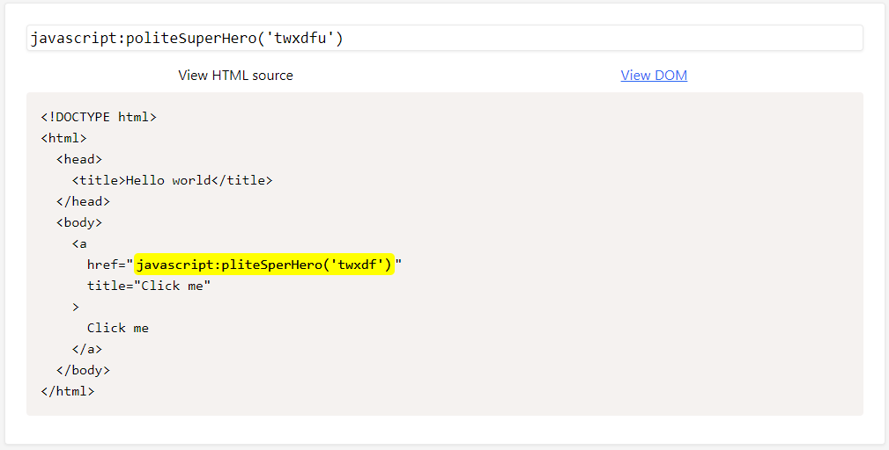
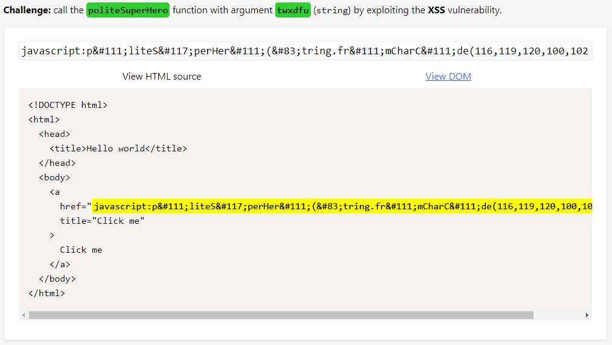

# Level 5 \(practice\)

## Challenge \#1

### Description

Appeler la fonction `prettyHuman()` avec la chaîne de caractères `"m5lccw"` en argument :

### Résolution

Ici, deux filtres sont en place : les occurrences du caractère `"c"` sont supprimées et le caractère `" " (espace)` n'est également pas disponible. Le filtrage du caractère `"c"` est gênant car notre balise `` n'est pas utilisable :

Il est possible de contourner le filtrage du caractère `"c"` en passant par un tag `<svg>`ainsi que de l'encodage unicode suivant le contexte. Le `"/"` permet de contourner la suppression du caractère `" " (espace)` :

## Challenge \#2

### Description

Appeler la fonction `prettyRobot()` avec la chaîne de caractères `"elcmf4"` en argument mais cette fois sur l'attribut `src` dans une balise `` :

### Résolution

Il faut plusieurs essais avant de déterminer les quelques filtres en place ici. Il semble que l’occurrence `"on"` ne soit pas permise ainsi que l’occurrence `"rr"` qui est transformée en `"r"`. De plus le caractère `"t"` ne semble pas permis non plus :

Concernant le `"on"` de `onerror` on peut passer par le balise `<script></<script>`. Pour avoir une seule occurrence de `"r"` on en renseigne un second, puis, finalement, on utilise l'encodage unicode pour contourner le filtre sur le caractère `"t"` :

## Challenge \#3

### Description

Appeler la fonction `politeSuperHero()` avec la chaîne de caractères `"twxdfu"` en argument mais cette fois sur l'attribut `href` dans une balise `<a>` :

### Résolution

Dans ce challenge, le caractère `"u"` ainsi que le caractère `"o"` sont filtrés :

Etant donné que le `"u"` est filtré, il n'est pas possible d'utiliser l'encodage unicode. On utilise donc les HTML entities pour le filtrage des caractères `"o"` et `"u"`. Concernant le `"u"` présent dans la chaîne passée en argument on utilise la fonction `String.fromCharCode()` . On utilise également les HTML entities car on se rend compte que la chaîne `"String"` est également filtrée :

Je me suis rendu compte seulement après, mais le filtrage sur le `"o"` est contournable en le doublant \(par exemple `"oo"`\).

