# Level 6 \(practice\)

## Challenge \#1

### Description

Appeler la fonction `politeSuperHero()` avec la chaîne de caractères `"v1hiyw5"` en argument :

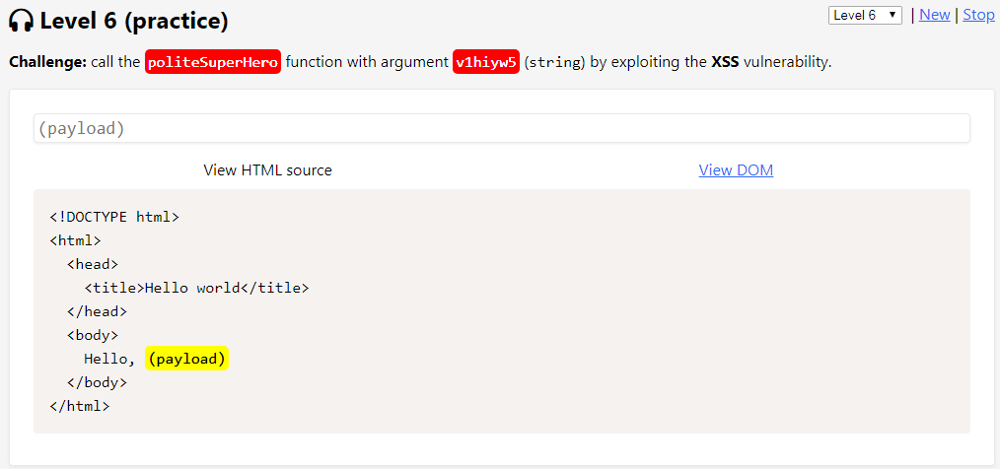

### Résolution

Un filtrage est effectué sur les caractères `"e"` et `"u"`. Cela va empêcher l'utilisation de l'encodage unicode. Un filtre est aussi présent sur le caractère `" " (espace)` :

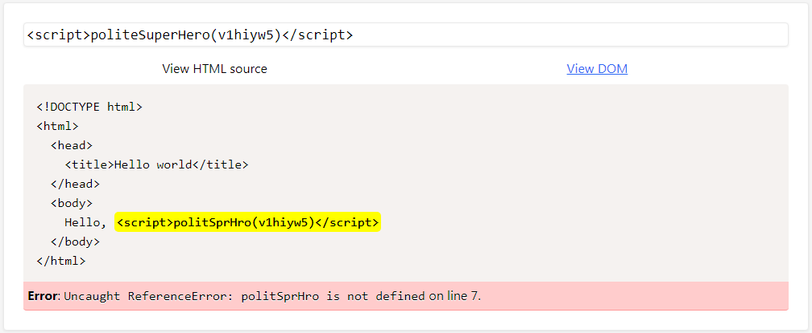

Difficile de pouvoir appeler la fonction `politeSuperHero()` sans pouvoir utiliser l'encodage unicode. On tente de contourner cela en passant par un label `<svg>` et en ajoutant un `"/"` pour contourner le filtrage du caractère `" " (espace)` . L'utilisation des HTML entities permet de gérer le cas du `"u"` et du `"e"` :

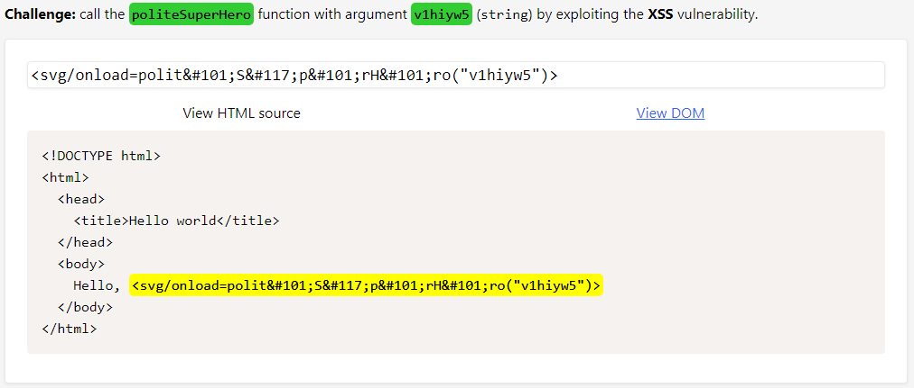

## Challenge \#2

### Description

Appeler la fonction `prettyHuman()` avec la chaîne de caractères `"xdheb3s"` en argument mais cette fois sur l'attribut `src` dans une balise `` :

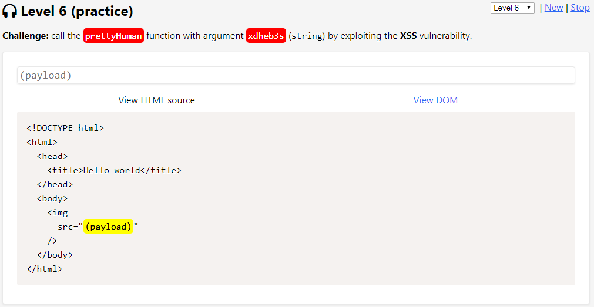

### Résolution

On tente d'utiliser l'attribut `onerror` de la balise image afin d'exécuter la fonction javascript mais un mécanisme semble filtrer les occurrences `"on"` ainsi que le caractère `"d"` :

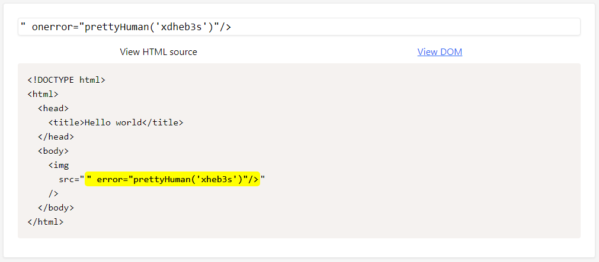

On réussi à contourner le filtre sur l'occurrence `"on"` en le répétant une seconde fois. Le caractère `"d"` présent dans la chaîne de caractères passée en paramètre peut, par exemple, être représenté par son équivalent en base64 :

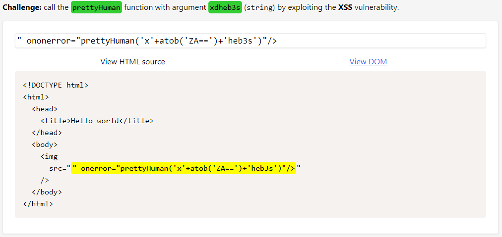

## Challenge \#3

### Description

Appeler la fonction `politeFunction()` avec la chaîne de caractères `"237chw3"` en argument mais cette fois sur l'attribut `href` dans une balise `<a>` :

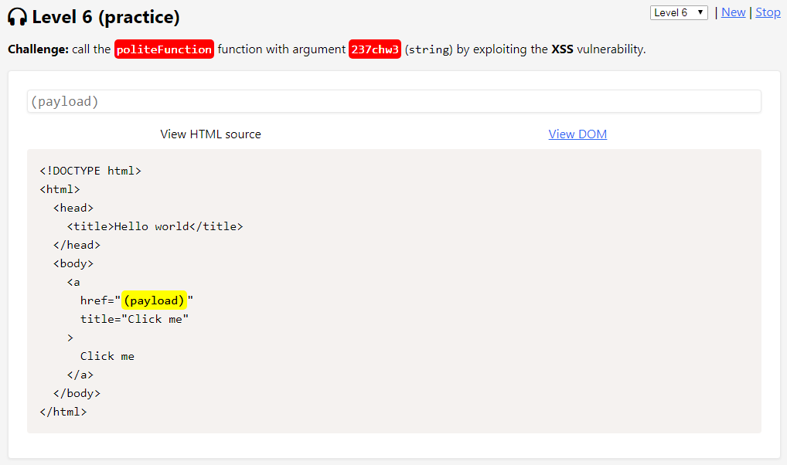

### Résolution

Etant donné que nous sommes au sein d'un attribut `href` nous allons tenter d'utiliser la syntaxe `javascript:code`. Le filtre en place supprime le caractère `"t"` ainsi que le caractère spécial `"'" (simple quote)` :

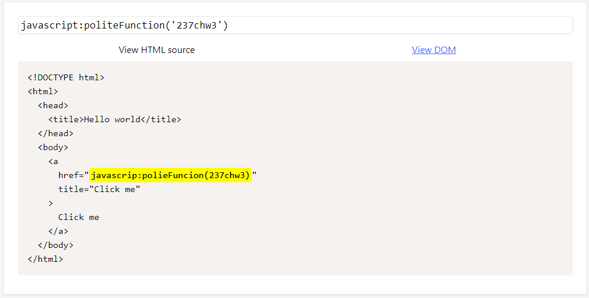

Il est possible de contourner le premier filtre en utilisant la majuscule, soit `"T"`. Pour les occurrences du caractère `"t"` présents dans le nom de la fonction il est possible d'utiliser l'encodage unicode, puis les HTML entities pour les deux `"'" (simple quote)` entourant la chaîne de caractère en argument :

## Challenge \#4

### Description

Appeler la fonction `tallSuperHero()` avec la chaîne de caractères `"rj7tfb1"` en argument mais cette fois sur la valeur de la propriété `background-color` du sélecteur `banner` :

### Résolution

L'objectif est ici de sortir de la balise `` et d'injecter du javascript. Le mot clé `"script"` semble être filtré ici. De même pour le caractère `"f"` nécessaire dans la chaîne de caractères devant être passée en argument :

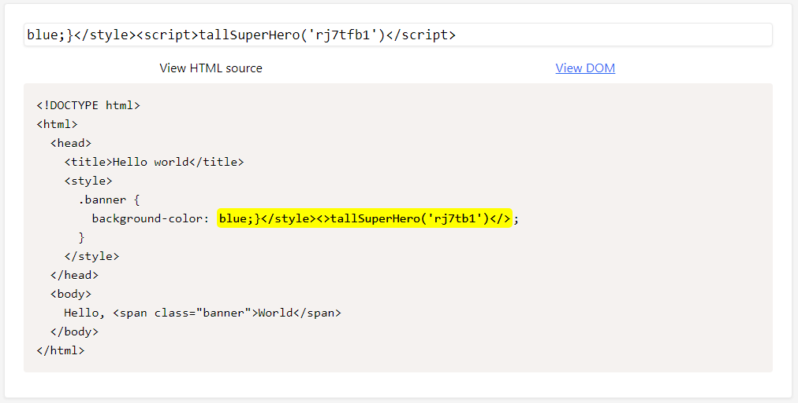

Il est possible de contourner le filtre sur la chaîne `"script"` en mélangeant les majuscule et les minuscules. Pour le caractère `"f"`, j'utilise l'encodage base64 car le caractère `"0"` est en fait également filtré, ce qui empêche l'utilisation de l'encodage unicode :

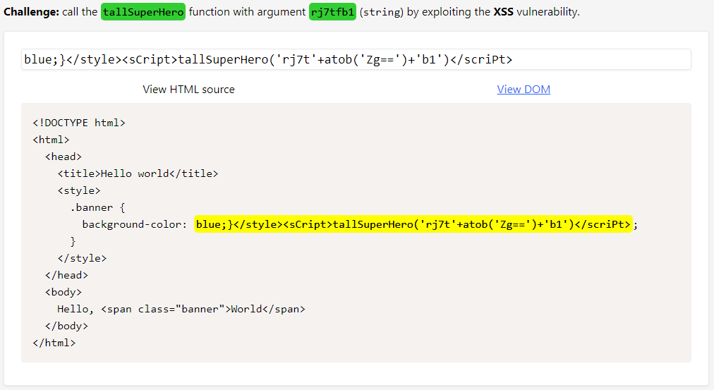

## Challenge \#5

### Description

Appeler la fonction `kindHuman()` avec la chaîne de caractères `"lxu2w3b"` en argument mais cette fois sur l'attribut `value` du tag `<input/>` :

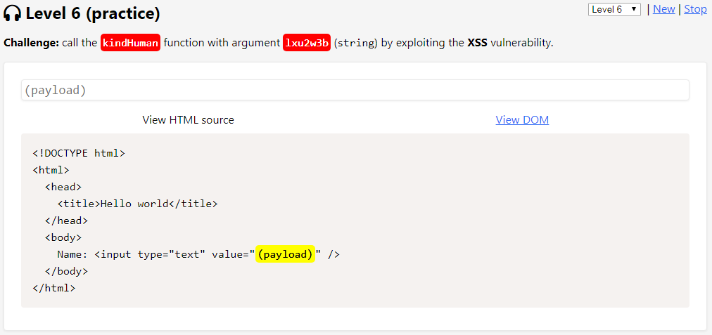

### Résolution

Celui-ci est relativement facile. Nous allons utiliser l'attribut `onmouseover` et tenter de déclencher la payload via la vue DOM. Le seul caractère filtré est le `"H"` présent dans le nom de la fonction :

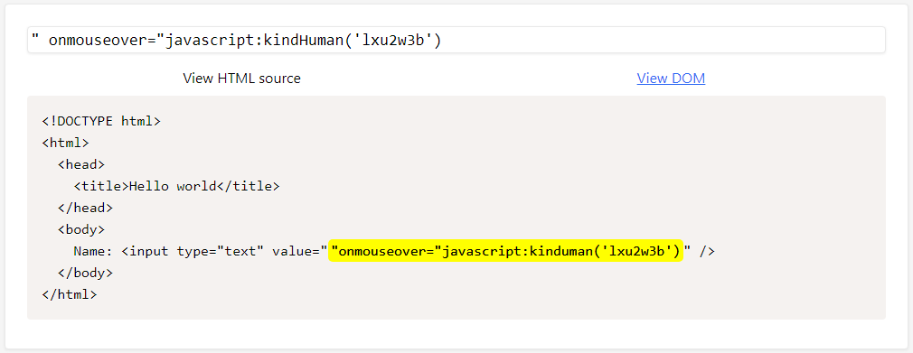

L'encodage unicode suffit à contourner cette limitation :

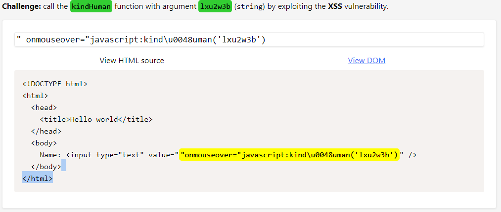

## Challenge \#6

### Description

Appeler la fonction `niceSuperHero()` avec la chaîne de caractères `"7451rf5p"` en argument au sein de la valeur d'une variable Javascript :

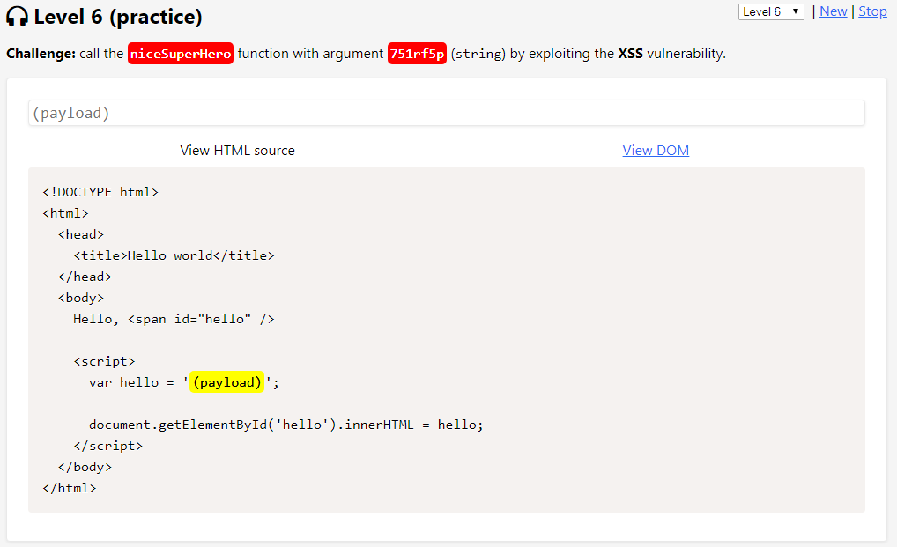

### Résolution

Une première tentative nous indique un filtrage sur les caractères `""" (double quotes)`, `")"` et `"5"`:

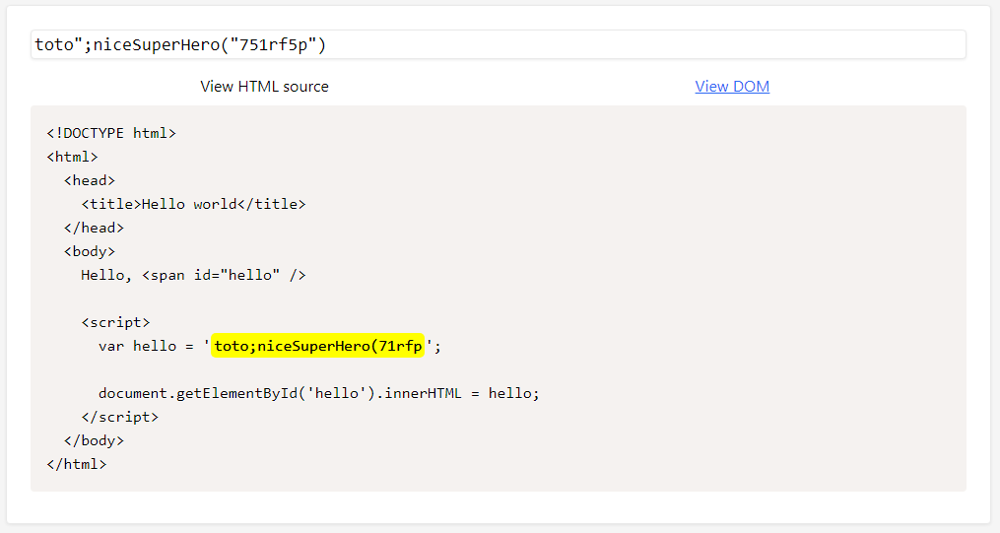

Pour réussir ce challenge, j'ai mis fin à la balise `<script>` et démarrer une nouvelle balise `<svg>` me permettant d'utiliser les HTML entities pour le caractère `")"`. Pas de réelle difficulté sur le contournement du filtre du caractère `""" (double quotes)`, il suffit simplement d'utiliser la version simple `"'" (simple quote)` :

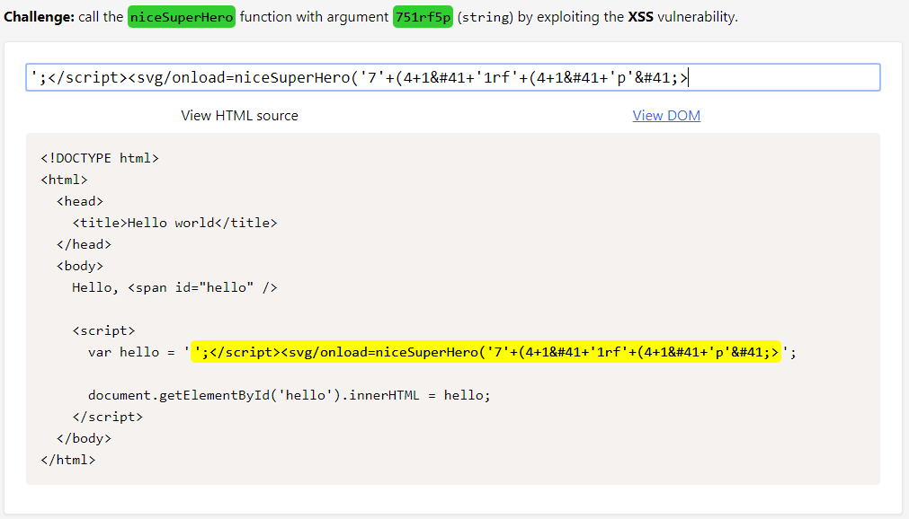

## Challenge \#7

### Description

Appeler la fonction `tallSuperHero()` avec la chaîne de caractères `"gt31knj"` en argument mais cette fois en valeur d'une donnée JSON stockée dans la variable `window.appData` :

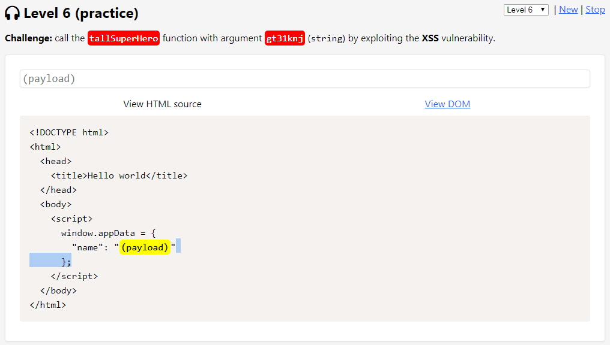

### Résolution

Il nous faut ici sortir de la payload JSON. Le plus simple est sans doute de fermer correctement le JSON puis la balise `<script>` et d'ouvrir de nouvelles balises. Cela fonctionne quasiment du premier coup puisque seul le caractère `"g"` présent dans la chaîne passée en argument est filtré :

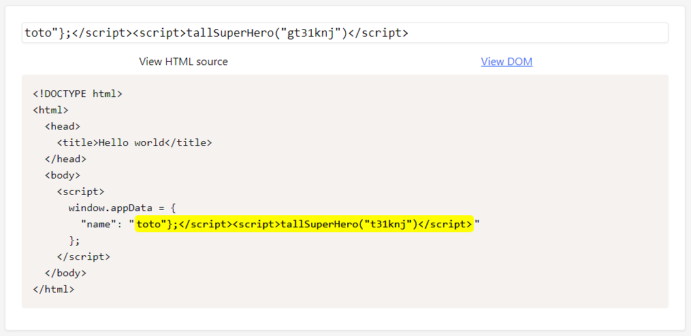

Après un nouvel essai, il n'est pas possible d'utiliser l'encodage unicode car le caractère `"0"` est aussi filtré. L'encodage base64 vient à notre rescousse, mais en fait non ... Les simples quotes `"'"` sont également filtrées. Je décide alors de tenter ma change avec la fonction `String.toLowerCase` et d'utiliser le `"G"` au lieu du `"g"` :

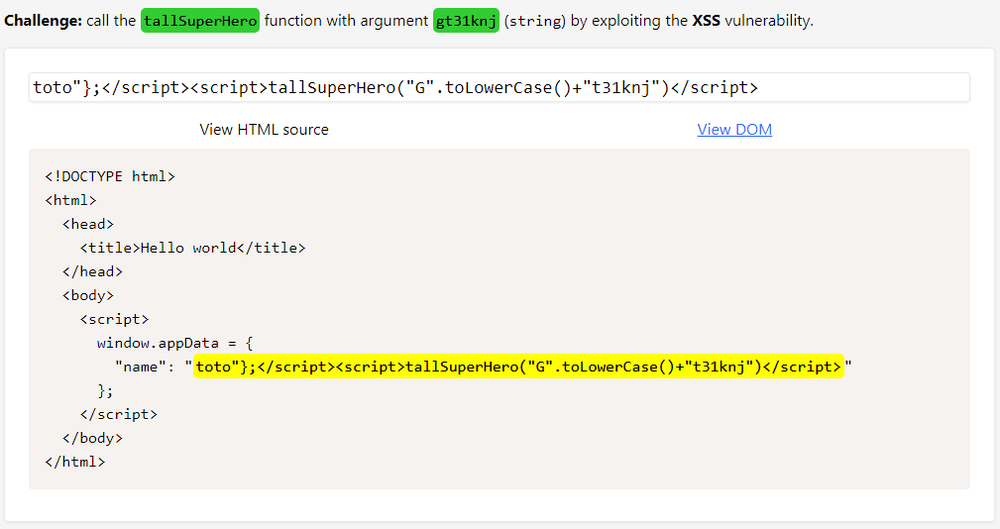

