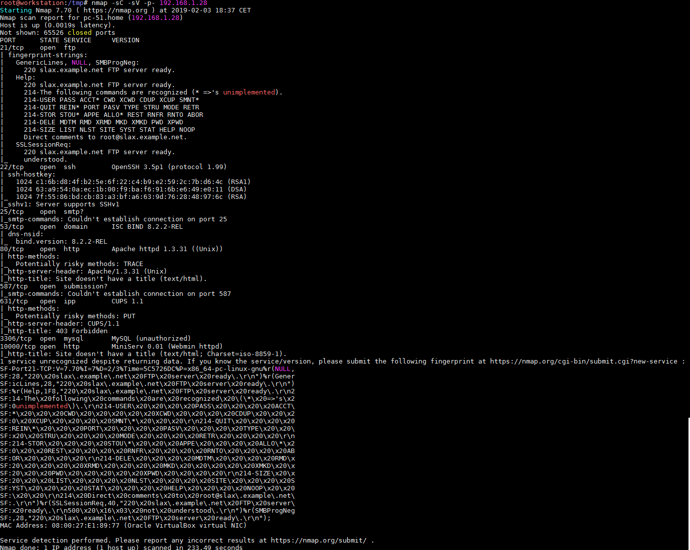
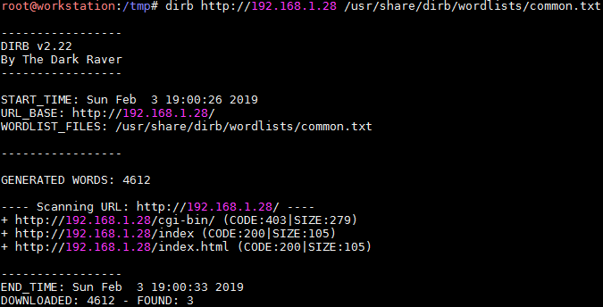
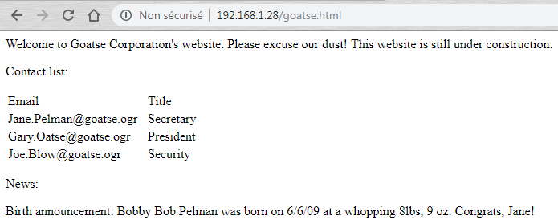
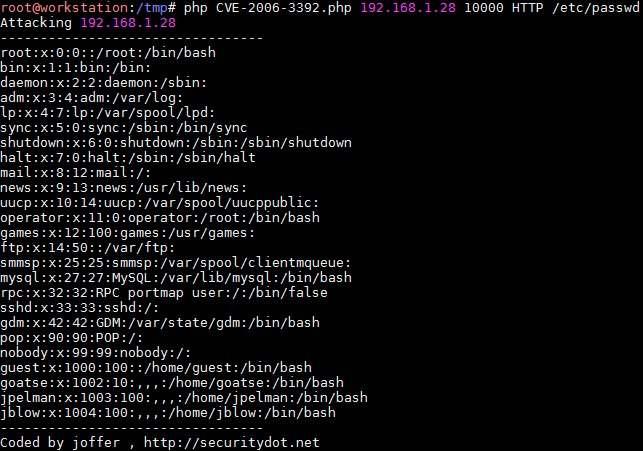
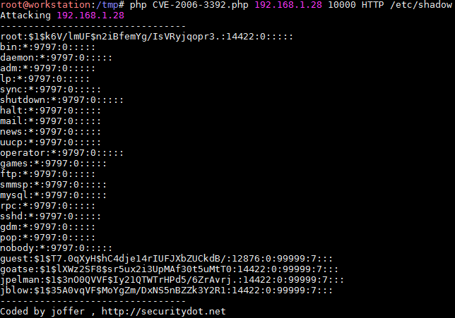

# GoatseLinux: 1

## Détails de la machine

**Nom :** GoatseLinux: 1  
**Date de sortie :** 27 Juin 2009  
**Lien de téléchargement :** [http://neutronstar.org/tmp/GoatseLinux\_1.0\_VM.rar](http://neutronstar.org/tmp/GoatseLinux_1.0_VM.rar)  
**Niveau :** Facile  
**Objectif\(s\) :** obtenir un accès "root"  
**Description :**`GoatseLinux v1.0 pentest lab Virtual MachineSteve Pordon  
2009.06.27  
Feel free to distribute this far and wide under the gnu license.  
This is specifically built for VMware 6.5 compatibility.  
WARNING: GoatseLinux is intentionally unsecure. It was designed as a laboratory box to practice penetration testing on. Due to the wide open nature of nearly every program installed on it, I would strongly advise against setting your VM network to anything other than "host-based," unless you enjoy your VMs being used as zombie spamboxes.  
Notes:  
Built on the Slax 5.0.7 distro.  
Source: readme.txt`  

## Reconnaissance

Pour scanner une cible on doit tout d'abord connaitre son adresse IP. Cela peut se faire grâce à l'outil `netdiscover` :

Le listing des services via `nmap` pour l'adresse IP 192.168.1.28 :

### Service HTTP

Rien de très intéressant sur le service web \(qui est en cours de construction\) disponible sur le port 80 malgré un `nikto` et un `dirb`.

Résultat du `nikto` :

Résultat du `dirb` :

La page "goatse.html" qui est disponible quand on clique sur l'image d'accueil permet de récupérer trois adresses emails ainsi que la fonction de chacun des utilisateurs :

L'analyse s'arrête ici pour le serveur web, on continue avec le prochain service : Webmin.

### Webmin

Une recherche sur le webmin permet d'identifier une vulnérabilité de type Arbitrary File Disclosure :

Toutes les version inférieures à 1.290 sont vulnérables à un Arbitrary File Disclosure

## Exploitation

### Webmin \(CVE-2006-3392\)

L'exploitation reste très simple avec un script PHP existant. On récupère un premier fichier qui est "/etc/passwd" :

On continue avec le fichier "/etc/shadow" :

On va tenter de cracker les mots de passe grâce à John The Ripper. Pour cela tout d'abord un `unshadow` :

Puis on lance `john` :

On récupère quatre des cinq mots de passe possibles

## Élévation de privilèges

On se connecte avec chacun des comptes en SSH \(à noter l'utilisation de quelques options SSH car la machine cible commence à se faire vieille\) :

Un de ces comptes possède les droits `sudo` :

Travail terminé

## Conclusion

Aucune difficulté ici car le Webmin était déjà connu grâce à d'autres machines et l'élévation de privilèges ne requiert aucune recherche particulière \(sauf se connecter sur tous les comptes pour connaitre celui qui possède les droits `sudo`\).

