# LAMPSecurity: CTF5

## Détails de la machine

**Nom :** LAMPSecurity: CTF5  
**Date de sortie :** 10 Mai 2009  
**Lien de téléchargement :** [http://sourceforge.net/projects/lampsecurity/files/CaptureTheFlag/CTF5/ctf5.zip/download](http://sourceforge.net/projects/lampsecurity/files/CaptureTheFlag/CTF5/ctf5.zip/download)  
**Niveau :** Facile  
**Objectif\(s\) :** obtenir un accès "root"  
**Description :**`This is the fifth capture the flag exercise. It includes the target virtual virutal machine image as well as a PDF of instructions. The username and password for the targer are deliberately not provided! The idea of the exercise is to compromise the target WITHOUT knowing the username and password. Note that there are other capture the flag exercises. If you like this one, download and try out the others. If you have any questions e-mail me at justin AT madirish DOT net.`  
****`The LAMPSecurity project is an effort to produce training and benchmarking tools that can be used to educate information security professionals and test products. Please note there are other capture the flag exercises (not just the latest one). Check the SourceForge site to find other exercises available (http://sourceforge.net/projects/lampsecurity/files/CaptureTheFlag/).  
These exercises can be used for training purposes by following this documentation. Alternatively you may wish to test new tools, using the CTF virtual machines as targets. This is especially helpful in evaluating the effectiveness of vulnerability discovery or penetration testing tools.`

## Reconnaissance

On détermine l'adresse IP de notre cible :

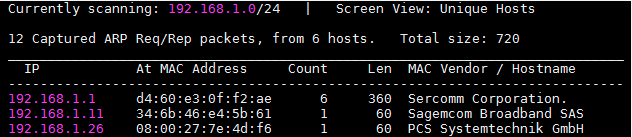

On découvre les services offerts par notre cible grâce à `nmap` :

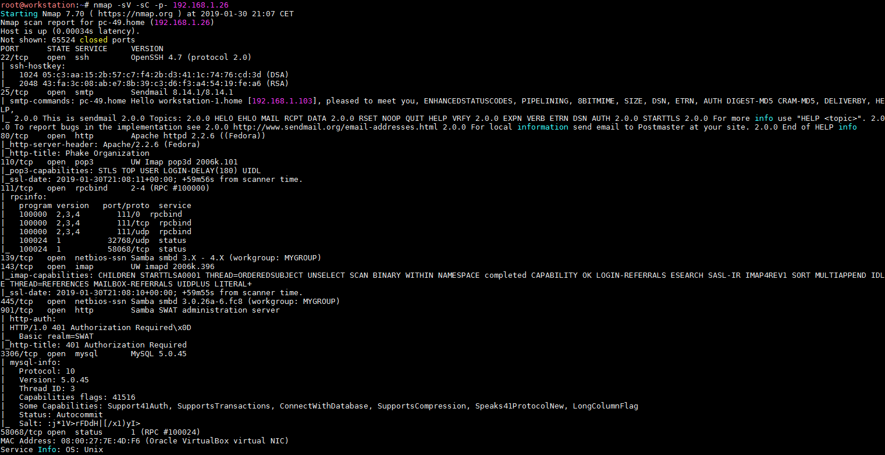

Un nombre intéressant de services sont en écoute sur cette machine. Un serveur Web sur le port 80 mais également une interface d'administration sur le port 901. Nous trouvons également du POP, RPC, IMAP ou encore du SMB.

### Samba

Un `rpcclient` en anonyme nous permet d'énumérer les utilisateurs présents sur la machine :

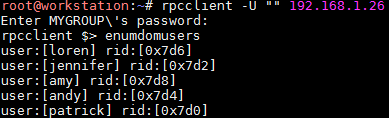

Je n'ai rien trouvé d'intéressant autre que cette énumération, il y avait bien des répertoires partagés mais aucun droit en lecteur/écriture ne semble permettre son exploitation par un utilisateur anonyme.

### Server HTTP

On s'attaque ici logiquement à la plus grosse partie des machines de type "LAMPSecurity", le serveur web. Je ne vais pas ajouter une impression écran pour chaque page/service disponible, car il y en a pas mal, mais voici la liste :

* La racine du site nous amène vers la page d'accueil de la "Phake Organization"
* Un blog est disponible à l'adresse "~andy"
* Un premier webmail "SquirrelMail" en version 1.4.11 sur "/mail"
* Un gestionnaire d’événements sur "/event"
* Une page d'enregistrement sur "/list"
* Un phpMyAdmin sur "/phpmyadmin"
* Une seconde URL "/squirrelmail" menant vers le webmail "SquirrelMail"

#### Phake Organization

Un seul paramètre de disponible sur cette page et c'est déjà une première faille, le paramètre "page" est vulnérable à une LFI/RFI :

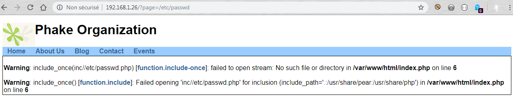

#### Andy Carp's Blog

Il s'agit ici d'un blog qui se base sur un CMS du nom de "NanoCMS". Pour continuer notre reconnaissance, nous devons récupérer la version de ce CMS afin d'identifier de possibles vulnérabilités. Un petit tour sur Google nous apprend que la version \(et bien plus encore\) est disponible à la page "/data/pagesdata.txt" :

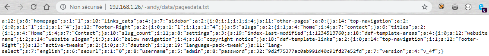

En effet, ce fichier contient le numéro de version du CMS \(le dernier champ\) mais aussi tout simplement le nom de l'administrateur ainsi que le condensat de son mot de passe.

#### phpMyAdmin

En ce qui concerne la version du phpMyAdmin il suffit d'accéder au fichier "README" pour connaitre sa version :

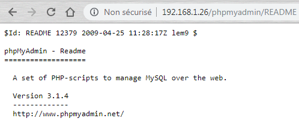

Rien de très intéressant avec cette version de phpMyAdmin selon `searchsploit`.

#### Page info.php

`nikto` nous remonte également la présence d'un fichier "/info.php" qui exécute en fait la méthode PHP `phpinfo()` :

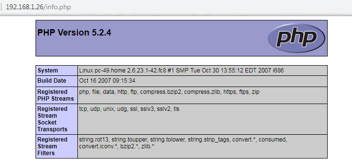

Ce fichier peut contenir des informations intéressantes, par exemple il est ainsi possible de connaitre les "streams" disponibles afin d'exploiter une potentiel LFI/RFI.

### Samba SWAT administration server

Ce service est protégé par une authentification de type HTTP Basic. Pas de chance, les quelques couples de login/mdp testés ne donnent rien :

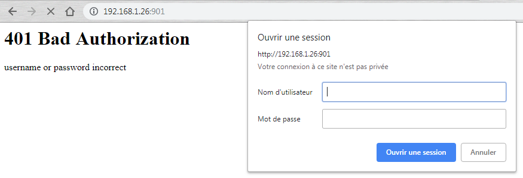

### Service MySQL

Il semblerait que la version 5.0.45 du service MySQL soit vulnérable à un buffer overflow avec la CVE-2008-0226 et un module de metasploit semble disponible :

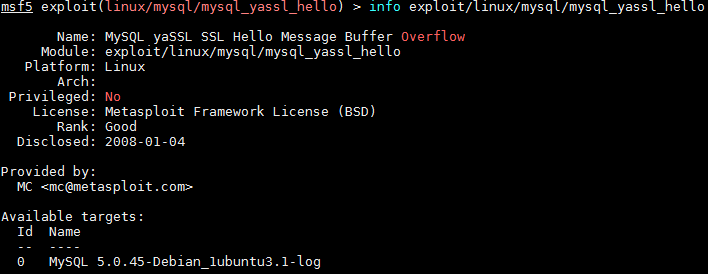

## Exploitation

### Local File Inclusion

Nous pouvons commencer par la LFI disponible sur la page d'accueil du site de la "Phake Organization". Il n'est pas possible ici d'effectuer une RFI, car il y a une concaténation avec le dossier "/inc" en préfix du nom du fichier. Il est toutefois possible de récupérer des fichiers locaux comme le "/etc/passwd", nous avons déjà la liste des utilisateurs grâce au Samba, mais pourquoi pas :

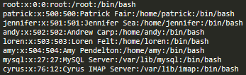

On peut également tenter de cracker le condensat du mot de passe présent dans le fichier "pagesdata.txt" de NanoCMS :

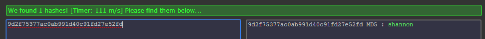

### Code injection

NanoCMS est également vulnérable à une injection de code, il suffit de créer une nouvelle page avec la payload PHP désirée. En ce qui concerne les différentes vulnérabilités de NanoCMS, je suis tombé sur ce très bon site \(en tout cas il y figure tout ce dont j'ai besoin\) : [http://www.madirish.net/304](http://www.madirish.net/304)

On utilise `msfvenom` afin de générer notre reverse shell en PHP :

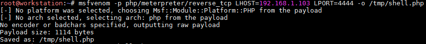

Puis grâce à une "nouvelle page" du blog on exécute notre payload :

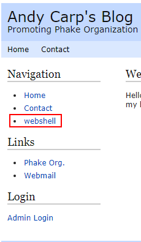

Et on récupère notre shell `meterpreter` avec metasploit :

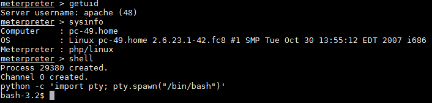

Une recherche de l'occurrence "password" remonte la présence d'un "root password" au sein de fichiers Tomboy.

Tomboy, que je connaissais pas \(non je ne parle pas du film 🙂 \) est un outil de prise de notes sur Linux. Il semblerait que l'utilisateur "Patrick" possède un post-it avec peut être le mot de passe "root" :

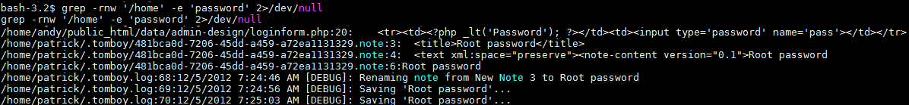

On tente donc d'afficher cette note :

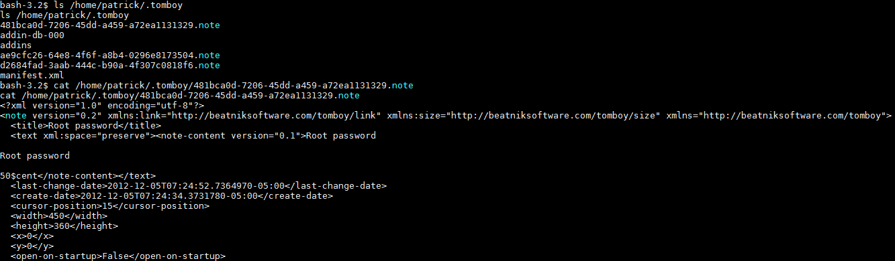

Le mot de passe "root" est "50$cent" \(un fan de rap ?\)

## Élévation de privilèges

L'élévation est ici facile puisque nous sommes en possession du mot de passe "root" :

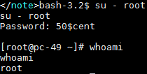

Travail terminé

## Conclusion

Machine plutôt facile. Bien que je ne connaissais pas Tomboy une recherche de mot de passe suffit pour trouver ce qui permettra l'élévation. A force de faire des machines, je commence à avoir mes routines une fois que je possède un point d'entrée sur le système : vérification des binaires suid, analyse des droits spécifiques sur certains fichiers, mot de passe faibles, listing des processus en exécution, etc. Rien de mieux que des petites cheat sheet faites par ses propres soins.

